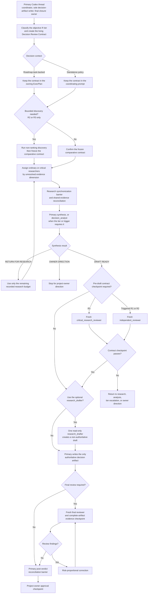

# Project-Scoped Codex Agents

This directory contains reusable Codex agent definitions and operational workflow tooling versioned with A11y Evidence Lab as portfolio artifacts. They define stable working roles; a coordinating prompt still supplies the existing roadmap task or policy owner, research tier, question or work slice, target artifact, criteria, write lease when applicable, output contract, budget, and stopping condition for each instance. Read-only research roles receive the [Research Assignment Capsule v1](#research-assignment-capsule-v1). Write-capable implementation workers receive the separate canonical [Milestone Assignment Packet v2](./execplan-implementation-workflow.md#milestone-assignment-packet-v2), whose compact capsule supplies exact authority anchors, production responsibility placement, and accepted evidence for one coherent work slice.

These agents support repository work. They do not change product scope, approve architecture, resolve an open decision, replace an ExecPlan, or count as implementation or acceptance evidence. All agents remain subject to the root [repository instructions](../AGENTS.md) and must begin repository work from the [documentation authority map and task router](../docs/README.md).

## Start Here

| Need | Start with | Continue with |
|---|---|---|
| Persistent repository rules and authority | [Repository instructions](../AGENTS.md) | [Documentation authority map and task router](../docs/README.md) and its task-specific reading order |
| Repeatable ADR, planning, acceptance, or verification procedure | [Read by task](../docs/README.md#read-by-task) | The applicable workflow guide, skill, authority, and only the supporting resources it routes to |
| Any bounded repository research | [Research work](#research-work) | Objective `R0` through `R3` classification and a Research Assignment Capsule when an agent is needed |
| Consequential decision work | [Decision work](#decision-work) | Decision Review Contract in the owning ExecPlan when roadmap-task-backed, or in the coordinating prompt for a standalone policy decision, plus the applicable research tier |
| Owner-authorized implementation ExecPlan | [Implementation workflow](./execplan-implementation-workflow.md) | [Write-lease guard](./write-lease-guard.md) and owning ExecPlan |
| Visible frontend implementation work slice | [Frontend quality skill](../.agents/skills/frontend-quality/SKILL.md) | Conditional `frontend-visual` profile in the implementation workflow; standard slices remain profile-neutral |
| Task-level project and agent-workflow progress | [Progress index](../docs/progress/README.md) | Existing roadmap task, owning ExecPlan when applicable, and accepted checkpoint evidence |
| Custom role selection | [Agent registry](#agent-registry) | Exact role TOML and bounded instance assignment |
| Project coordinator defaults | [Project Codex configuration](./config.toml) | [Model and reasoning policy](#model-and-reasoning-policy), explicit task overrides, and fresh-session verification |
| Operator-managed runtime concurrency | [Runtime concurrency capacity](#runtime-concurrency-capacity) | [Collaboration topology](#collaboration-topology), [implementation workflow](./execplan-implementation-workflow.md), and [write-lease guard](./write-lease-guard.md) |

Keep `AGENTS.md` concise and durable; put task-specific procedures in the linked ExecPlan, workflow, or repository skill. For initial navigation, read the authority map and matching task-router entry, then the controlling sections of this guide. Read a target document completely before editing it. Linked procedures are required when their route applies, not automatically for every task. Codex discovers repository skills under `.agents/skills` using progressive disclosure: it first sees skill metadata, then loads a selected `SKILL.md` and only the supporting resources needed for the task. Project-scoped custom agents live under `.codex/agents`; their definitions do not execute merely because the files exist.

Project-scoped `.codex` configuration loads only for a trusted project. A role file being present or syntactically valid does not by itself prove runtime discovery in the current session.

### Authorized continuation and delegation

The root [autonomy rules](../AGENTS.md#authorized-autonomy) distinguish a worker stop from an owner decision. `BLOCKED`, a changed binding field, or a rejected handoff stops the affected branch and returns control to the primary. The primary inspects the evidence and may resolve routine uncertainty or issue an authorized reconciled assignment within the existing scope and budgets. Only a missing owner-controlled input, required approval, scope expansion, or exhausted owner-controlled budget needs owner direction. Never use triage to reset a budget, bypass a readiness gate, or continue a closed lease; continue unaffected authorized work when possible.

Invoke roles required by the applicable R/S route without requesting permission again. Optional delegation needs a bounded independent subtask or unresolved evidence dimension and useful work for the primary while it runs. R0 remains primary-only; capacity alone does not trigger agents. Parallelize independent read-only work when useful, while retaining the implementation workflow's serial write ownership and fresh-review barriers.

Owner-requested standalone workflow and agent-configuration maintenance follows the policy route and primary sole-writer responsibility. It does not create a roadmap task, ExecPlan, progress record, or application-development authorization. An actual change to ADR-0024's ownership, correction budget, or TDD applicability still requires an explicit amendment or replacement.

## Agent Registry

| Agent | Permission boundary | Stable responsibility | Not responsible for |
|---|---|---|---|
| [`technology_researcher`](./agents/technology-researcher.toml) | Read only | Investigate one ordinary R1/R2 question or one non-critical dimension inside R3 and return source-traceable evidence plus optional artifact-ready fragments | Complete target-artifact drafting, repository edits, final synthesis, architecture approval, or task and gate status changes |
| [`critical_researcher`](./agents/critical-researcher.toml) | Read only | Investigate one R3 critical evidence dimension with the stronger configured model route and failure-path coverage | Ordinary research, complete target-artifact drafting, repository edits, final synthesis, approval, or closure |
| [`decision_analyst`](./agents/decision-analyst.toml) | Read only | When routing triggers it, audit research completeness and synthesis readiness; for decisions, also audit the Decision Review Contract, compare options, and return a traceable recommendation | Routine single-report synthesis, repository edits, artifact numbering or approval, owner-controlled choices, or task and gate status changes |
| [`research_drafter`](./agents/research-drafter.toml) | Read only | After synthesis and any required pre-draft checkpoint, transform one frozen conclusion into one non-authoritative target-artifact draft with provenance | New research, competing drafts, recommendation changes, repository edits, artifact lifecycle, approval, or closure |
| [`critical_research_reviewer`](./agents/critical-research-reviewer.toml) | Read only | Perform fresh adversarial review of an R3 contract checkpoint, final answer, or final decision artifact | Ordinary R0-R2 review, implementation review, editing, approval, or closure |
| [`independent_reviewer`](./agents/independent-reviewer.toml) | Read only | Try to falsify an ordinary higher-risk decision contract, work slice, or integrated final artifact against repository authorities and reproducible evidence | Editing the reviewed work, approving owner-controlled decisions, or taking closure ownership |
| [`milestone_reviewer`](./agents/milestone-reviewer.toml) | Read only | Review one ordinary completed implementation work slice proportionally and reuse fresh evidence | Critical-risk review, editing, or closure ownership |
| [`critical_reviewer`](./agents/critical-reviewer.toml) | Read only | Perform maximum-effort adversarial review when a named critical trigger applies | Routine work-slice review, editing, or closure ownership |
| [`test_worker`](./agents/test-worker.toml) | Workspace write under an explicit lease | Perform read-only preflight, then own one coherent work-slice Red or passing characterization | Production behavior, evidence-document edits, architecture decisions, status changes, Green authorization, or task closure |
| [`code_worker`](./agents/code-worker.toml) | Workspace write under an explicit lease | Perform bounded setup or work-slice Green, record changed-surface responsibility fit, and optionally perform a same-turn behavior-preserving Refactor | Changing an accepted test, evidence-document edits, selecting architecture, status changes, or task closure |
| [`frontend_code_worker`](./agents/frontend-code-worker.toml) | Workspace write under an explicit lease | Perform Green, record changed-surface responsibility fit, and optionally Refactor only for an accepted `frontend-visual` work slice, reuse audit, and visual contract | Standard-profile work, test changes, independent design authority, evidence-document edits, architecture or scope decisions, status changes, or task closure |

Codex identifies each custom agent by the `name` field inside its TOML file. The filenames follow the same names in kebab case for navigation only.

## Model and Reasoning Policy

The workflow routes model and reasoning effort by responsibility and risk. The initial 2026-09-08 owner-authorized Astra migration updated coordination, difficult synthesis, critical research, and demanding review while retaining ordinary Sol/Terra workers and each role's existing effort. The [research-review effort trial](#research-review-effort-trial) subsequently lowered only `critical_research_reviewer` from `max` to `xhigh`. The later [coordinator and worker trials](#coordinator-and-worker-trials) set the project coordinator default to Astra `high` and both implementation workers to Astra `medium`. The subsequent [ordinary researcher trial](#ordinary-researcher-trial) moves `technology_researcher` from Terra to Astra at unchanged `medium` effort. These are configured trial assignments, not a measured cost or quality ranking. The [project configuration](./config.toml) supplies defaults for fresh trusted-project sessions; explicit task selections may override them, and editing files does not change an already running session.

| Execution role | Model and effort | Rationale |
|---|---|---|
| Primary coordinating thread | `gpt-6-astra`, `high` as the project default; the operator may select `xhigh` for difficult integration or decisions, or another explicit setting | Owns routing, synthesis, guarded implementation coordination, authority reconciliation, and closure. The project config supplies the default; custom-agent files do not control the parent session. |
| `technology_researcher` | `gpt-6-astra`, `medium` | Trials Astra at unchanged effort for ordinary R1/R2 evidence and non-critical R3 dimensions, assessing accepted evidence quality and total workflow time and usage including rework. Critical dimensions retain their separate route. |
| `critical_researcher` | `gpt-6-astra`, `high` | Covers one R3 critical dimension whose security, integrity, identity, concurrency, recovery, irreversible-data, serialization, or cross-platform risk justifies the stronger route. |
| `decision_analyst` | `gpt-6-astra`, `xhigh` | Reconciles difficult multi-report synthesis; for decisions, also audits contract coverage, ranking, and decide-now versus prove-later boundaries. |
| `research_drafter` | `gpt-5.6-terra`, `medium` | Performs bounded transformation after the decision or conclusion is frozen; it does not research or decide. |
| `critical_research_reviewer` | `gpt-6-astra`, `xhigh` | Trials one lower effort level for R3 research review while preserving its complete review contract; quality and efficiency remain to be evaluated. |
| `milestone_reviewer` | `gpt-5.6-terra`, `high` | Reviews an ordinary completed work slice proportionally without paying maximum-effort cost. |
| `independent_reviewer` | `gpt-6-astra`, `high` | Reviews ordinary higher-risk work slices, decision checkpoints, and integrated final states. |
| `critical_reviewer` | `gpt-6-astra`, `max` | Performs quality-first adversarial review only for named critical triggers. |
| `test_worker` | `gpt-5.6-sol`, `medium` | Performs preflight and owns one coherent work-slice test contract while preserving a separate test context. |
| `code_worker` | `gpt-6-astra`, `medium` | Trials Astra at unchanged effort for bounded setup or work-slice Green and optional Refactor; complex slices are the priority comparison. Test ownership remains separate. |
| `frontend_code_worker` | `gpt-6-astra`, `medium` | Trials Astra at one lower effort level for rendered-UI Green under the accepted reuse and visual contracts. It gains no design or scope authority. |

Each custom-agent file's explicit `model` and `model_reasoning_effort` values take precedence. Before that file is applied, model and effort resolve from an explicit spawn override, then project `[agents]` defaults, then the parent session; other omitted session settings inherit from the parent. Current-turn runtime overrides can still supersede agent-file sandbox and approval defaults. The primary coordinator must confirm its actual model, reasoning, permissions, and working-tree state at the start of a consequential decision or implementation run. `Ultra` is not a substitute for these topologies: proactive delegation may help independent work, but the repository still requires named barriers, explicit write ownership, fresh review, bounded correction, and owner approval where applicable.

Role instructions remain necessary. More reasoning does not replace primary-source requirements, common criteria, explicit uncertainty, artifact-local completeness, read-only boundaries or write leases, or executable validation. If the configured model or effort becomes unavailable in a target Codex environment, update this policy and the affected agent files together rather than allowing silent drift. Compare policy changes on representative repository work instead of assuming that a higher effort alone improves the workflow.

The [official model guidance](https://developers.openai.com/api/docs/guides/latest-model), reviewed for GPT-6 Astra on 2026-09-08, recommends auditing instruction files, clarifying initiative and delegation, calibrating verification, and initially preserving effective reasoning effort. The [Sol model reference](https://developers.openai.com/api/docs/models/gpt-5.6-sol), [Terra model reference](https://developers.openai.com/api/docs/models/gpt-5.6-terra), and [Codex subagent documentation](https://learn.chatgpt.com/docs/agent-configuration/subagents) cover retained models and custom-agent precedence. Model upgrades do not amend repository ownership or permission contracts.

### Migration evaluation

Use a small manual comparison on representative work before claiming an improvement. Keep task inputs, acceptance criteria, available tools, and effective effort comparable: first compare the previous model with Astra using unchanged instructions, then compare the original and revised instructions on the same model. Changing both at once cannot isolate the cause. Before the initial Astra migration, the primary and the five research, analysis, and review roles migrated in that step used Sol; the ordinary worker pins were unchanged in that initial step. The later coordinator, worker, and ordinary researcher trials have their own comparison settings below.

| Sample | Observe |
|---|---|
| Documentation review or standalone workflow maintenance | Correct authority route, no synthetic roadmap task, concise actionable findings, no unnecessary authorization pause |
| Ordinary implementation slice | Correct preflight and separate test/code ownership, bounded correction, relevant checks, complete handoff |
| Rendered UI slice | Conditional frontend worker and skill, task-owned browser evidence, no invented UI scope or extra review layer |
| Consequential research or implementation review | Correct R/S route, fresh reviewer, concrete defects or evidence gaps, preservation of owner-controlled gates |

Read-only scenario probes can check routing and instruction interpretation without starting application work. They do not establish implementation quality, browser behavior, cost, or runtime efficiency. Actual work samples require their own existing task authorization; do not reopen completed work or select a future task merely to populate this comparison. Record only concise observations in the existing policy maintenance result or an authorized task's normal evidence record, with no telemetry or benchmark subsystem.

Validate changed definitions in a fresh trusted session: check discovery of the exact roles and their effective model/effort using runtime evidence when available. An agent's self-description or a TOML parse alone is insufficient. If the runtime cannot expose or activate the role, report that limit and do not treat the old session as upgraded. Revisit a pin when representative evidence shows a material regression; do not silently fall back or claim savings from fewer agents.

### Research-review effort trial

The 2026-09-08 trial changes only the dedicated `critical_research_reviewer`. The shared `independent_reviewer` remains Astra `high`, the implementation-only `critical_reviewer` remains Astra `max`, and `milestone_reviewer` remains Terra `high`. Research and implementation review need separate evidence before extending the reduction. The [Astra launch benchmarks](https://openai.com/index/gpt-6-astra/) report the best score at any effort; they do not establish equivalent review quality at adjacent settings. The [reasoning-effort guidance](https://developers.openai.com/api/docs/guides/reasoning#reasoning-effort) supports evaluating the quality, latency, and token-use tradeoff.

Before claiming an improvement, compare `xhigh` and `max` with the same original review artifacts, instructions, tools, and acceptance criteria. Include known substantive defects and clean examples; compare missed defects, unsupported findings, and total review time including rework. Neither effort is ground truth. Reuse the bounded manual evaluation route above without reopening application tasks or adding a benchmark subsystem. This configuration change and runtime discovery alone do not establish equal defect detection or savings.

Retain `max` as a return option for unusually difficult reviews or evidenced material misses at `xhigh`. Record the reason in the existing coordinating context, update this policy and the role's explicit effort pin together, and verify the setting in a fresh trusted session before relying on it; a spawn override cannot supersede the role-file pin. Any additional review remains within the existing review and correction budgets. The trial changes no R3 coverage, fresh-review requirement, evidence standard, permission boundary, or approval gate.

### Coordinator and worker trials

The 2026-09-08 owner-authorized trial prioritizes Codex subscription usage and completion time. The current defaults are coordinator Astra `high`, `code_worker` Astra `medium`, and `frontend_code_worker` Astra `medium`. Those coordinator and worker trials left the other nine role definitions unchanged, including the separate research-review effort trial; the ordinary researcher trial below is subsequent. There is one explicit pin per worker role: the code-worker trial also applies to ordinary setup and Green assignments, with no automatic per-task Sol fallback.

Evaluate the coordinator change first by comparing Astra `high` with its earlier `xhigh` setting. For the frontend worker, compare Sol `high` with Astra `high` to isolate the model change, then compare Astra `high` with the configured `medium` trial. Compare code-worker Sol `medium` with Astra `medium`, prioritizing complex slices. These are future comparisons under existing task authorization, not completed benchmarks or authorization to reopen application work. Use Standard mode and comparable inputs, tools, instructions, and acceptance criteria; assess accepted quality, total workflow time including corrections, and available allowance evidence. The [official pricing](https://learn.chatgpt.com/docs/pricing) and [speed guidance](https://learn.chatgpt.com/docs/agent-configuration/speed) distinguish credit rates, variable included usage, and Fast-mode premiums. A lower effort or stronger model alone proves no saving.

Keep the existing bounded evaluation and evidence-recording rules; add no telemetry, trial role, or benchmark subsystem. Preserve all TDD, test ownership, write leases, frontend-profile boundaries, review routes, and correction budgets. If a worker trial shows material quality regression or an unacceptable usage/time tradeoff, its return setting is Sol `medium` for `code_worker` or Sol `high` for `frontend_code_worker`. Record any comparison or return setting in the existing coordinating context, synchronize the affected role file and this policy, and verify it in a fresh session; spawn overrides cannot supersede explicit role-file pins. The operator may select coordinator `xhigh` for difficult work without changing the project default. A persistent coordinator-default change updates [config.toml](./config.toml) and this policy together.

### Ordinary researcher trial

The 2026-09-08 owner-authorized trial changes only `technology_researcher` from Terra `medium` to Astra `medium`. It preserves the role's instructions, read-only boundary, research routing, and correction budget; all other model and effort pins stay unchanged. The single explicit pin applies to every assignment of this role, with no automatic Terra fallback. The [reasoning-effort guidance](https://developers.openai.com/api/docs/guides/reasoning#reasoning-effort) supports `medium` as a balanced starting point for research and judgment, not a proven optimum for this workflow.

Compare Terra `medium` with Astra `medium` using the same capsules, source access, tools, instructions, acceptance criteria, and Standard mode. Assess source accuracy, constraint coverage, uncertainty handling, and total workflow time and available allowance evidence through an accepted decision, including clarification, review, and rework. Use the existing bounded migration evaluation; configuration and discovery alone prove no quality improvement or subscription saving. If representative evidence shows material quality regression or an unacceptable usage/time tradeoff, the return setting is Terra `medium`. Record the reason in the existing coordinating context, synchronize this policy and the role file, and verify the setting in a fresh trusted session before relying on it.

## Runtime Concurrency Capacity

The spawned-agent ceiling belongs to each operator's untracked `~/.codex/config.toml`; this repository neither versions nor requires a numeric value. The current operator profile uses:

```toml
[agents]
max_concurrent_threads_per_session = 6
```

The [official Codex configuration reference](https://learn.chatgpt.com/docs/config-file/config-reference) defines this key as the maximum number of spawned-agent threads and excludes the primary thread. This value therefore permits up to six spawned agents alongside the primary coordinator, or seven active threads in total. It is a ceiling, not a workload target or guaranteed allocation; the coordinator must use the capacity actually available in the current session, and another operator may select a lower value without creating repository drift. The [official subagent documentation](https://learn.chatgpt.com/docs/agent-configuration/subagents) owns the runtime feature semantics.

Additional slots are useful for bounded, independent work, especially read-only research and review. They do not expand task scope, grant write authority, increase correction budgets, replace fresh review, or relax closure ownership. Write-capable implementation still follows the [serial work-slice flow](./execplan-implementation-workflow.md) and permits only one active [write lease](./write-lease-guard.md) per worktree; Red and Green writers never run concurrently for the same slice. Truly independent concurrent writers require separate worktrees and separate baselines.

## Collaboration Topology

### Research work

Every bounded repository research request receives one objective research tier before agents are assigned. The tiers are routing classifications, not a menu to choose opportunistically. The primary records the highest triggered tier and its evidence; uncertainty selects the higher tier, an owner may escalate, and a tier may be lowered only after evidence disproves the triggering condition. Research tiers do not replace the separate `S0` through `S3` implementation review tiers.

| Tier | Trigger | Default route |
|---|---|---|
| `R0` | Repository-local fact gathering, deterministic inspection, or no unresolved external evidence | Primary only; no researcher, analyst, drafter, or LLM reviewer by default |
| `R1` | One bounded, reversible question with one material evidence dimension and no owner-controlled or critical semantics | At most one `technology_researcher`; primary synthesis; optional single `research_drafter` only for a substantial target artifact; review only when the target's authority requires it |
| `R2` | Cross-boundary or consequential choice, multiple material evidence dimensions, three or more viable candidates, conflicting current sources, or an owner-approval artifact | Up to two `technology_researcher` instances when unresolved evidence requires them, assigned by evidence gap rather than automatically by candidate; conditional `decision_analyst`; optional single drafter after synthesis; fresh final semantic review for an ADR or other owner-controlled decision artifact |
| `R3` | Custom serialization, integrity, identity, concurrency, recovery, cross-platform equivalence, irreversible data, security, closely ranked contradictory candidates, or decision-critical mechanics outside the frozen contract | Enough ordinary or `critical_researcher` reports to cover every critical dimension under an explicit capsule budget; every dimension carrying the named R3 trigger uses `critical_researcher`. Decision-oriented R3 requires `decision_analyst` and a fresh `critical_research_reviewer` pre-draft checkpoint. Answer-only R3 uses primary synthesis unless an analyst trigger remains and always receives complete fresh `critical_research_reviewer` final review. Drafting and repository writing apply only when a target artifact exists. |

Research cost grows with unresolved evidence and consequence, not with the raw number of candidates. A requirement to compare three strategies does not require three agents. Prefer one researcher per independent evidence dimension when that produces a symmetric comparison, and assign by candidate only when candidate-specific evidence cannot be compared credibly in one dimension report. A hard-gate failure ends candidate-local expansion after the failure and reversal condition are evidenced.

For R2 or R3, the primary may run one bounded discovery pass before comparative research. Discovery may identify credible candidates, primary sources, hard disqualifiers, evidence dimensions, and triggered invariants; it must not rank candidates or recommend an option. Freeze the comparison contract after discovery. Later evidence may reopen it only through the recorded material-change and stopping rules.

Independent assignments may run concurrently. The primary waits at one research synchronization barrier, reuses still-fresh evidence IDs instead of paying for duplicate source collection, and sends only the compact capsule plus directly linked authority fragments. A researcher or analyst may remain alive for one bounded follow-up in the same research run; freshness is reserved for independent review.

### Research Assignment Capsule v1

Every spawned researcher, analyst, drafter, or research reviewer receives a compact capsule containing:

- stable research identity, `R0` through `R3` tier, trigger rationale, and budget;
- exact question or evidence dimension, candidate set when applicable, and target artifact or answer;
- authority anchors, known repository facts, shared evidence IDs, and freshness conditions;
- common criteria, hard gates, forbidden scope, and owner-controlled boundaries;
- required output structure, maximum useful detail, success result, and stopping conditions; and
- permission boundary, peer synchronization rule, follow-up allowance, review stage and fresh-instance requirement when applicable, and next barrier.

The capsule is an assignment projection, not a new authority document. For a decision-oriented ExecPlan, it projects the living Decision Review Contract. For research without an ExecPlan, it may live only in the coordinating prompt or final research record. Do not create a tracked plan, report, or ledger solely to administer R0 or R1 work.

### Research budgets and stops

| Tier | Default execution budget |
|---|---|
| `R0` | No spawned research role |
| `R1` | One researcher and at most one targeted follow-up; zero analysts; at most one drafter when a substantial artifact is already selected |
| `R2` | At most one discovery pass, two concurrent research reports, one bounded follow-up round, one triggered analyst pass plus one bounded correction, at most one drafter, and the authority-required final review |
| `R3` | The Research Assignment Capsule states the justified report count, critical evidence dimensions, analyst and review budget; a Decision Review Contract additionally owns these fields for decision-oriented work. The existing two-cycle correction ceiling applies when a final artifact exists. |

Stop and reconcile instead of spawning more work when the same decisive evidence gap appears twice, two synthesis attempts return `RETURN FOR RESEARCH` without materially new evidence, the capsule budget is exhausted, or a new finding changes scope or triggers a higher tier. Reuse the same non-review agent for its one bounded follow-up when available. Use role counts and stopping conditions as the workflow budget controls; do not record token or cost counters, invent estimates, or treat lower agent count alone as proof of lower cost.

Role results route explicitly. `RESEARCH COMPLETE` enters the synchronization barrier. `FOLLOW-UP REQUIRED` permits only the capsule's one bounded follow-up; when its budget is absent or exhausted, the primary reconciles or escalates instead of respawning. `BLOCKED` stops dependent synthesis until the primary supplies the missing authority, evidence, scope, or owner direction. `SYNTHESIS READY` ends answer-only analysis; `DRAFT READY` freezes an artifact conclusion without approving it. `RETURN FOR RESEARCH` uses only the remaining recorded evidence budget, and `OWNER DIRECTION` stops at the owner boundary. `DRAFT BLOCKED` never authorizes a partial repository write: the primary returns to the missing evidence or decision boundary, while `DRAFT COMPLETE` supplies one provenance-mapped input for primary reconciliation.

Research routing ends at an evidence-backed answer, recommendation, or primary-written authoritative artifact. It never opens a write lease or authorizes production behavior. If an approved research result leads to implementation, start from the exact existing roadmap task, its dependencies and readiness or evaluation-freeze gates, and the preflight boundary. Enter the separate worker-first implementation workflow without carrying an `R` tier, research capsule, or drafter permission forward.

### Decision work

Decision-oriented work uses the generic research tiers with a contract-first, sole-writer graph. This diagram is a navigation aid; the surrounding prose defines the binding routing and review semantics.



The contract and evidence checkpoints are agent-workflow controls, not product requirements, ADRs, open-decision resolutions, or the task-closure documentation gate. The reviewer labels belong to instances, not permanent definitions. When both pre-draft and final review are required, use separate fresh instances: `critical_research_reviewer` for R3 and `independent_reviewer` for an ordinary triggered R1/R2 decision. No permanent panel is required.

For decision work, the primary thread is deliberately not duplicated as a custom `coordinator` agent. It owns tier classification, orchestration, synthesis when no analyst is triggered, every authoritative repository write, approval handling, integration, and final closure. The `research_drafter` writes no file and makes no decision; `DRAFT COMPLETE` only gives the primary a provenance-mapped input to reconcile. The final reviewer receives the authoritative inputs, living contract, cumulative invariant packet, exact artifact, and diff, and independently reproduces material evidence instead of treating the prior review or primary summary as proof.

### Implementation work

Write-authorized implementation ExecPlans use the complementary [worker-first ExecPlan implementation workflow](./execplan-implementation-workflow.md). For executable production behavior, the primary delegates bounded edits through this repository's accepted milestone-slice sequence: read-only test preflight, test-owned characterization or Red when required, then Green and optional Refactor by exactly one selected implementation context. A separately justified non-behavioral setup records `TDD: Not applicable` and goes directly to guarded `code_worker` setup with replacement evidence. The primary retains integration, evidence acceptance, bounded test-correction exception handling, approvals, authoritative status, and closure. The default `standard` profile uses `code_worker`; only a work slice that materially changes rendered UI uses the conditional `frontend-visual` profile and `frontend_code_worker`.

For each coherent work slice, the primary creates one compact `Milestone Assignment Packet v2`. The packet name is retained for compatibility; its Work-slice ID is runtime correlation inside one existing roadmap task, not another project milestone. Every application-source slice uses the common responsibility-and-cohesion fields; the standard route has no profile marker or visual capsule, while only a rendered-UI slice appends the conditional `frontend-visual` marker and capsule before preflight. The primary keeps one test-worker instance and only the applicable implementation-worker instance alive for that slice, then retires them after the work-slice barrier. Agent persistence reduces repeated context loading but never persists write authority: every implementation-worker write turn has a fresh packet, baseline, digest, lease ID, and terminal close. If a live instance is unavailable, the primary respawns it from the same capsule.

The [frontend-quality skill](../.agents/skills/frontend-quality/SKILL.md) owns profile classification, the preflight reuse audit, and the visual-evidence boundary. A future UI-source path does not select the visual profile by itself: setup, types, data access, service calls, state plumbing, and nonvisual routing remain standard. A frontend-visual work slice adds no new test owner, reviewer, risk tier, correction loop, or closure gate; it substitutes the specialized Green worker and gives the existing risk-routed reviewer the accepted reuse and browser evidence.

When TDD applies, the test worker first performs read-only preflight and returns `EXISTING_AND_COVERED`, `EXISTING_BUT_UNCOVERED`, `MISSING`, `REGRESSION`, `PARTIAL`, `CONFLICTING`, or `UNKNOWN`. Existing covered behavior needs no write. Existing uncovered behavior receives a guarded passing characterization. Missing or regressed behavior follows serial Red then Green. For `PARTIAL`, the coordinator confirms and isolates the explicit missing gap before only that gap follows Red then Green. `CONFLICTING` or `UNKNOWN` stops for triage.

The [first-module Red exception](./execplan-implementation-workflow.md#first-module-red), accepted in ADR-0024, permits an intentional missing production module/export as initial Red only after environment verification and with complete behavioral tests for the slice. Record capability absence honestly, not executed behavioral coverage; separate Green must execute every accepted test unchanged and pass strict typechecking. This adds no stub, worker phase, or permission to bypass other gates.

The primary opens and terminally closes the [automatic write-lease guard](./write-lease-guard.md), then inspects the receipt, actual diff, command results, and handoff. Red precedes Green when behavior is missing or regressed; accepted Red evidence can be reused without duplicate execution only while its command, working directory, relevant-tree fingerprint, environment fingerprint, and no-drift condition still match. Accepted test-owned files remain unchanged only during the implementation worker's Green turn. The test worker may revise tests under its own lease, and the primary may make one bounded exceptional test correction between leases; either path invalidates the prior evidence and requires the test boundary to be accepted again before Green resumes.

Default work-slice limits are one preflight, one coherent Red or characterization, one Green, at most one same-contract correction per role, one review correction loop, stop after the same decisive failure twice, and stop after two no-diff write handoffs. An attempt-2 correction names its terminal attempt-1 parent; the guard rejects a second child for that parent while the coordinator retains responsibility for semantic same-contract validation. More than three TDD cycles in one slice requires rescoping instead of silent microcycling.

Review is risk-routed:

| Tier | Typical surface | Review route |
|---|---|---|
| `S0` | Documentation-only or deterministic mechanical work inside an implementation ExecPlan work slice | Fresh `milestone_reviewer`, reusing deterministic evidence; S0 work outside an implementation ExecPlan needs no LLM reviewer unless another trigger applies |
| `S1` | Ordinary bounded application work slice | Fresh `milestone_reviewer` |
| `S2` | Cross-boundary service, persistence, browser, retrieval, provider, UI integration, or equivalent consequential work slice | Fresh `independent_reviewer` |
| `S3` | Security, irreversible data, concurrency, locking, recovery, custom integrity or identity, or cross-platform byte equivalence | Fresh `critical_reviewer` |

The [model policy](#model-and-reasoning-policy) owns each role's model and effort. An unresolved Blocker or Major from an ordinary reviewer, or explicit project-owner direction, also triggers critical review. For application-source work, every implementation-review route applies the common [changed-surface quality baseline](./execplan-implementation-workflow.md#changed-surface-quality-baseline) after behavioral Green; the frontend route adds reuse and browser evidence without another reviewer. Exact-path authorization contains writes but does not prove that responsibility placement is cohesive. Final ordinary integration uses a fresh `independent_reviewer`; use `critical_reviewer` only when a critical trigger remains. Reviewers reuse fresh evidence and rerun missing, stale, contradictory, externally mutable, or risk-critical checks rather than reflexively repeating every suite.

The implementation topology above remains unchanged by research-tier routing: write-capable implementation workers do not perform research assignments, draft ADRs, resolve gates, or replace the primary decision writer. Research roles never receive implementation write leases, and Research Assignment Capsules never authorize repository edits.

### Progress summaries

The primary coordinator maintains the manual [project and agent-workflow progress index](../docs/progress/README.md). Create one living summary only after an existing roadmap task enters `In progress`; update it after an accepted material work-slice or integration checkpoint and at task closure. Include a reconciled blocker or next-boundary change only when it is part of that accepted checkpoint. Record outcomes, roles and routes actually used, accepted review or correction results, decisive evidence links, and the next boundary. Do not record every turn, duplicate the ExecPlan, copy raw reports or lease state, or add hooks, token/cost tracking, or generated telemetry. The roadmap remains the status authority, and the ExecPlan remains the detailed coordination and evidence record.

## Decision Review Contract and Risk Tier

For a roadmap-task-backed ExecPlan that compares consequential options or prepares an ADR, the primary coordinator creates a living Decision Review Contract inside that ExecPlan before comparative option research. A standalone policy decision with no selected roadmap-task owner keeps the same contract in the coordinating prompt and passes it to every assigned role and reviewer; do not invent a tracked ExecPlan, task ID, or separate contract document solely to host it. Before any bounded discovery pass, record the stable scope, authority, approval boundary, basic criteria, and forbidden changes; discovery cannot rank or recommend. After discovery, freeze the candidate set, evidence dimensions, hard gates, triggered invariants, and routing tier before comparative research. Link to authority owners and record:

- exact roadmap task or policy owner, relevant decision boundary, `R1` through `R3` classification and triggers, target artifact, approval boundary, and forbidden scope;
- common criteria, evidence classes, and required artifact-local sections or outputs;
- hard gates and score, recommendation, artifact-status, task-state, and gate-state invariants;
- a decide-now versus prove-later disposition so downstream implementation proves defined semantics rather than inventing them;
- a cumulative invariant packet with a plan-local ID, trigger or fixture, expected result, evidence or actual result, and responsible reviewer; and
- researcher assignment basis, analyst and drafter triggers, correction, escalation, re-entry, budget, and stopping conditions.

Every invariant packet covers artifact completeness, evidence honesty, and authority-state consistency. Add triggered invariants when the decision defines state transitions or concurrency, integrity or identity, deterministic or canonical bytes, cross-platform equivalence, recovery, or ownership. Re-run every applicable invariant after a material revision, not only the invariant that previously failed.

The synthesis barrier returns one readiness result. The primary may own this result for R1 and straightforward R2 work. A `decision_analyst` is mandatory for R3 and is triggered for R2 when three or more viable candidates remain materially close, reports contradict each other, decide-now versus prove-later semantics remain unresolved, or an owner-controlled choice prevents evidence-only synthesis. The analyst is not added merely because three candidates were listed. The result is:

- `DRAFT READY`: research is comparable, every required contract item is covered, decision semantics are complete enough to draft, and remaining unknowns are explicitly assigned to downstream proof. This does not approve the decision.
- `RETURN FOR RESEARCH`: evidence is missing, asymmetric, stale, or contradictory, or decision semantics remain unresolved.
- `OWNER DIRECTION`: an owner-controlled value choice, scope boundary, or exhausted stopping condition prevents an evidence-only recommendation.

A fresh contract checkpoint is required before drafting for R3 and whenever any of these risk triggers applies. Use `critical_research_reviewer` for R3 and `independent_reviewer` for a triggered R1/R2 decision:

- the decision defines a custom serialization, integrity, identity, concurrency, recovery, or cross-platform contract;
- a decision-semantic uncertainty is proposed for deferral as downstream runtime proof;
- candidates remain closely ranked or materially contradictory; or
- a correction introduces decision-critical mechanics outside the reviewed contract.

For R1 or R2 decisions without a trigger, the recorded `DRAFT READY` synthesis result is the contract checkpoint, whether issued by the primary or analyst. A triggered independent checkpoint permits one supported outline correction; if it still does not pass, return to research, analysis, tier escalation, or project-owner direction instead of drafting. Only after `DRAFT READY` and every required checkpoint may one `research_drafter` transform the frozen synthesis into one non-authoritative draft. The primary may instead draft directly and remains the sole authoritative writer in either case.

## How to Invoke the Workflow

Custom agents do not run automatically merely because their files exist. The coordinating request must name the roles, barriers, and stopping conditions. For example:

### Research and decision workflow prompt

```text
Act as the primary coordinator for the exact bounded research question. Classify
it R0, R1, R2, or R3 from objective triggers and record the highest trigger. Do not
spawn agents for R0. For R1 through R3, issue Research Assignment Capsule v1 with
exact authority anchors, evidence dimensions, budget, permissions, and stops.

For consequential decision work, create or verify the living Decision Review
Contract in the owning ExecPlan when roadmap-task-backed, or in the coordinating
prompt for a standalone policy decision. R2 or R3 may use one non-ranking discovery pass;
freeze the comparative contract afterward. Assign researchers by unresolved
evidence dimension unless candidate-specific research is necessary. Wait at one
barrier and reconcile shared evidence without duplicate collection.

Use technology_researcher for ordinary R1/R2 evidence and non-critical R3
dimensions, and critical_researcher for every dimension carrying an R3 trigger.
For answer-only research, use primary synthesis unless
an R2/R3 contradiction or complexity trigger requires decision_analyst; accept
SYNTHESIS READY, RETURN FOR RESEARCH, or OWNER DIRECTION, and give every R3 final
answer a complete fresh critical_research_reviewer evidence review.

For decision-oriented research, use primary synthesis for R1 and straightforward
R2, invoke decision_analyst for an R2 trigger and always for R3, and require DRAFT
READY, RETURN FOR RESEARCH, or OWNER DIRECTION. For R3 use a fresh pre-draft
critical_research_reviewer; for a triggered R1/R2 decision use a fresh
independent_reviewer. Draft only after the applicable checkpoint passes.

After the conclusion is frozen, either have the primary draft directly or invoke
one read-only research_drafter for one non-authoritative, provenance-mapped draft.
The primary reconciles it and performs the only repository write. Use fresh final
semantic review when the tier or target authority requires it, apply the bounded
risk-proportional correction protocol, reconcile authority state, and stop at every
project-owner approval boundary.
```

A good instance assignment states:

- the research identity, exact task or policy owner, `R` tier and trigger, target artifact, question or evidence dimension, and review stage;
- the authoritative repository inputs, Research Assignment Capsule, and Decision Review Contract when one applies;
- common comparison criteria, evidence IDs, freshness conditions, hard gates, or invariant IDs;
- whether repository writes are allowed;
- the required output structure and evidence;
- whether the coordinator must wait for peer results or use a fresh instance; and
- the success, budget, follow-up, escalation, re-entry, and stopping conditions.

### Implementation workflow prompt

Use the concise copy-paste prompt, canonical assignment packet, and lease contract in the [worker-first ExecPlan implementation workflow](./execplan-implementation-workflow.md#copy-paste-prompt-example). It defines the serial normal path and deliberately returns exceptions to coordinator triage.

## Review, Correction, and Approval Protocol

When a tier or target authority requires a final evidence checkpoint, the fresh reviewer returns `PASS`, `PASS WITH FOLLOW-UPS`, `REVISE`, or `BLOCKED` with evidence. Every R3 final answer, every Proposed ADR, and every other owner-controlled R2 or R3 decision artifact receives this checkpoint; an R0 or ordinary R1 research answer with no authoritative repository mutation does not receive an LLM reviewer by default. A `PASS WITH FOLLOW-UPS` may advance only after the primary dispositions every item and confirms that none conflicts with a definition of done, hard gate, required validation result, or documentation gate. The bounded decision-artifact review loop below remains specific to research-derived decision artifacts. Implementation exceptions continue to return to coordinator triage under the unchanged implementation guide.

For an answer-only R3 result, `REVISE` permits one supported, in-scope primary correction followed by complete fresh `critical_research_reviewer` review within the capsule's recorded correction budget. `BLOCKED` returns to the exact missing evidence, unavailable prerequisite, or owner-direction boundary. A material scope or conclusion change invalidates the prior review and returns to tier classification and research; exhausting the correction or evidence budget stops for owner direction. This answer-only loop authorizes no repository write and does not reset a researcher follow-up allowance.

1. The primary coordinator applies only supported, in-scope corrections.
2. For R1 or R2, a trace-only, formatting, link, or explicitly non-normative documentation correction may use deterministic validation plus focused review of the exact diff. A normative correction, any Blocker or Major, or any uncertain classification requires complete revised-artifact review and the full applicable invariant packet. R3 always receives complete revised-artifact review and the full packet.
3. A correction that introduces a new normative subsystem or other decision-critical mechanics invalidates the prior contract checkpoint and may escalate the R tier. Update the living contract and repeat the applicable research, synthesis, and fresh checkpoint without silently resetting the final correction count.
4. After two unsuccessful final-artifact correction cycles, or after the same decisive research gap appears twice without new evidence, freeze the proposal and ask the project owner for direction.

After cycle exhaustion, the project owner may reject the proposal, authorize named fixes plus one fresh review, or authorize a new two-cycle budget. A newly discovered Blocker or Major outside the authorized remediation returns to the owner. Do not infer a new budget from permission to make one named correction.

Before presenting any proposal for approval, the primary coordinator performs a post-verdict reconciliation barrier. It verifies the exact reviewed artifact against the Decision Review Contract and aligns the reviewer verdict, open findings, hard gates, score, recommendation, artifact status, task and gate states, documentation impact, and next action. `REVISE` or `BLOCKED` permits correction or owner direction, never an acceptance-ready presentation.

Human-controlled decisions remain human controlled. A researcher report, analyst verdict, or `DRAFT COMPLETE` result cannot accept an ADR, change a requirement or open-decision status, or close the owning roadmap task. Decisions already at an explicit owner-approval checkpoint when this policy is adopted retain their completed review evidence; do not fabricate a retrospective tier, contract checkpoint, or drafting pass. Any later material change to such a proposal activates the current material-change invalidation rule before a new approval request.

## Validation

Run the smallest checks that cover the changed Codex surface; do not run optional tooling merely because it exists.

| Changed surface | Proportional repository check |
|---|---|
| Any local documentation or navigation | Resolve every affected relative Markdown link, review changed authority/status language, and run `git diff --check`; use a repository-provided validator if the selected development task later adds one |
| Agent definitions | `python -c "import pathlib,tomllib; files=sorted(pathlib.Path('.codex/agents').glob('*.toml')); [tomllib.loads(path.read_text(encoding='utf-8')) for path in files]; print(f'Parsed {len(files)} agent TOML files.')"` |
| Project coordinator configuration | Parse `.codex/config.toml`, check its model and effort against the policy, and verify the effective parent setting in a fresh trusted session without a model/effort override. Explicit saved task settings may still take precedence. |
| New or changed agent role or model pin | In a fresh trusted project session, confirm that the exact TOML `name` is discoverable and check effective model/effort against runtime evidence before relying on the changed definition. A successful parse, self-report, or already-open session does not prove activation. Use the bounded [migration evaluation](#migration-evaluation) for behavior claims. |
| New or changed skill | Run the installed `$skill-creator` structural validator, confirm discovery in a fresh trusted project session, and exercise representative direct, indirect, incomplete, non-activating, and unsupported-scope requests. If the validator cannot start because its own dependency is unavailable, report that check as blocked and use an independent YAML/frontmatter parse only as supplemental evidence. |
| Conditional frontend profile | Confirm that the common packet and standard ExecPlan shape contain no profile marker or frontend evidence fields; confirm that only the conditional capsule contains `Implementation profile: frontend-visual`; parse the specialized agent and skill; then run the write-lease check below. |
| Write-lease guard | `python -B .codex/leases/lease_guard.py self-test` |
| Any changed text | `git diff --check` |

TOML parsing validates syntax only. A fresh trusted Codex project session establishes project-layer discovery; parsing does not prove runtime activation.

Apply the [task-closure documentation gate](../docs/README.md#task-closure-documentation-gate) after the component checks. When architecture or ADR semantics change, also verify the ADR index, related authority links, and decision-history consistency.

## Permission and Evidence Boundaries

The [model policy](#model-and-reasoning-policy), [project coordinator configuration](./config.toml), and role TOMLs own the default parent setting and explicit role assignments. Research, drafting, and review roles are read-only. Test and implementation workers use `workspace-write`, but only an explicit coordinator-issued path lease with a pinned automatic-guard contract authorizes a particular edit. Test-worker preflight is read-only by workflow contract and has no lease; the configured sandbox does not itself enforce that narrower phase, so any write is a violation. Current-session permission overrides may still be applied by the Codex client, so the primary thread must inspect permissions and the working tree before relying on isolation.

All authoritative repository writes derived from research remain centralized in the primary thread. A research drafter returns text only and never receives a write lease. During write-authorized implementation, ordinary application source, test, dependency, fixture, or executable-configuration edits are delegated to the work-slice-local test worker or profile-selected implementation worker in the serial order defined by the implementation guide. Persistence retains role context, not leases or authority. The primary may maintain the ExecPlan, canonical authorities, status, or guard controls only between worker leases. Its only direct implementation-side exception is a bounded test correction between leases; it must record the reason, paths, and validation, invalidate the earlier test evidence, and re-accept the boundary before Green resumes. Any other implementation correction receives a new bounded worker packet and lease.

Agent output is a supporting observation, not self-validating proof. A terminal compliant lease receipt proves only that net non-ignored repository changes stayed within the pinned path contract and that the guard's explicitly sealed Git index, `HEAD` object and symbolic ref, selected settings, and ignore controls did not drift. It does not cover all Git write operations or metadata and does not prove semantic correctness. Write-capable workers therefore remain contractually prohibited from Git write operations and metadata mutations and may use Git only for read-only inspection. The primary agent must inspect the final repository state, run the task's authoritative validators, perform the documentation-impact review, and own the handoff. A lease-guard failure freezes the affected write branch.

Repository instruction discovery follows the official OpenAI documentation for [custom instructions with `AGENTS.md`](https://learn.chatgpt.com/docs/agent-configuration/agents-md). Repository skill location and progressive disclosure follow [Build skills](https://learn.chatgpt.com/docs/build-skills). The file schema and project-scoped `.codex/agents/` location follow the [Codex subagent documentation](https://learn.chatgpt.com/docs/agent-configuration/subagents). Project-layer trust and configuration follow the [configuration reference](https://learn.chatgpt.com/docs/config-file/config-reference).
