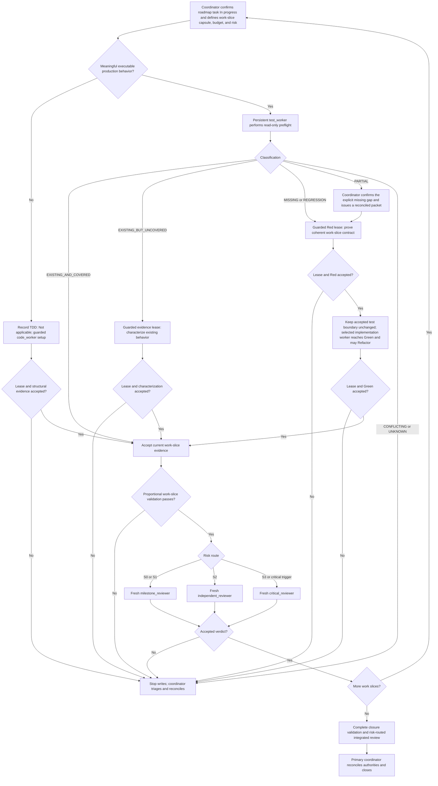

# Implement an ExecPlan with worker agents

This guide defines the normal implementation path for an authorized ExecPlan. Work advances by coherent, independently verifiable work slices inside one existing roadmap task rather than one agent turn per assertion or microbehavior. It deliberately keeps exception handling outside the main graph: when a classification, lease, handoff, command, requirement, budget, or review result is not acceptable, writing stops and the primary coordinator decides what the new assignment must be.

The workflow adds three controls without replacing the ExecPlan, plus one conditional frontend-visual profile:

- a compact work-slice capsule and assignment packet so each role starts with only the authority, responsibility boundary, and evidence it needs;
- a machine-verified write lease so the worker can change only the assigned paths; and
- separate test and code contexts, serial Red-Green-Refactor handoffs when behavior is missing or regressed, work-slice review, and risk-scaled final review; and
- a reuse-first, browser-evidenced overlay only for work slices that materially change rendered UI; the standard profile remains unchanged for every other slice.

## When to use this flow

Use it when the project owner authorizes implementation of an active ExecPlan and its owning existing roadmap task is `In progress`. The coordinator must first verify that task's dependencies, applicable Accepted Must requirements and decisions, and stated evaluation-freeze conditions. Do not use it to start a Not started or Blocked task, approve architecture, resolve an open decision, or turn a plan into implementation evidence.

The flow supports:

- read-only preflight by the work slice's persistent `test_worker` before any test lease when production behavior is in scope;
- `evidence` by `test_worker` for a passing characterization of existing uncovered behavior;
- `setup` by `code_worker` through a separately justified non-TDD route for declarative or infrastructure work;
- `red` by `test_worker` for one coherent observable work-slice contract;
- `green` plus optional behavior-preserving Refactor by `code_worker` for the standard profile or `frontend_code_worker` for the frontend-visual profile in one implementation turn; and
- proportional work-slice review followed by risk-routed integrated review.

Only one write-capable worker lease may be active in one worktree. Test and implementation workers remain separate and their write phases are always sequential when TDD applies. Before assigning roles, the coordinator records whether the slice has meaningful executable production behavior. A non-behavioral setup records `TDD: Not applicable` and uses only `code_worker`; a behavior-bearing slice uses this repository's accepted milestone-slice preflight and TDD route. The unchanged standard profile is implicit. Before behavior preflight, the coordinator determines whether the work slice triggers the conditional frontend-visual overlay and keeps one test-worker instance plus only the applicable implementation-worker instance alive for the current slice so bounded follow-ups retain role-local context. Persistence never carries a lease across turns: every write follow-up receives a fresh packet, baseline, digest, and terminally closed lease. Retire selected workers at the work-slice barrier; if the runtime cannot preserve an instance, respawn from the capsule.

## Roles

| Role | Responsibility |
|---|---|
| Primary coordinator | Defines work-slice contracts and budgets, creates capsules, packets, and leases, accepts or rejects handoffs, integrates evidence, routes risk, handles approvals and exceptions, and owns final closure. It may make a bounded exceptional test correction between leases, but that invalidates the affected accepted test evidence. |
| `test_worker` | Performs read-only preflight, then owns a coherent test-side Red or passing characterization under a lease. It never writes production behavior. |
| `code_worker` | Performs bounded setup or reaches minimum complete work-slice Green, dispositions the changed surface's responsibility fit, and optionally Refactors in the same turn. It never changes an accepted test. |
| `frontend_code_worker` | Reaches minimum complete Green, dispositions the changed surface's responsibility fit, and optionally Refactors only for a `frontend-visual` work slice with an accepted reuse audit and visual contract. It never performs standard-profile work or changes an accepted test. |
| `milestone_reviewer` | Reviews one ordinary completed work slice and its reusable evidence proportionally. It does not repair findings or close the task. |
| `independent_reviewer` | Reviews ordinary higher-risk work slices or the integrated final state at Sol high. It does not repair findings or close the task. |
| `critical_reviewer` | Performs maximum-effort review only for a named critical-risk trigger. It does not repair findings or close the task. |

## Worker Assignment Packet v1

Worker Assignment Packet v1 is superseded by the work-slice-scoped packet below. This compatibility heading remains for source-workflow compatibility; new work must use v2.

## Milestone Assignment Packet v2

Create one compact work-slice capsule before preflight and update it only when accepted work-slice evidence changes. Complete an assignment packet before preflight and every implementation-worker write turn. The capsule is the role's default context boundary: link exact authority anchors instead of copying whole documents, and expand reading only to resolve a named uncertainty. Additional reading never expands the objective, authority, commands, dependencies, expected result, budget, or write lease.

Create the stable workflow ID before the first assignment. Use one work-slice ID for each independently verifiable ExecPlan slice. This is a runtime correlation ID derived from the owning roadmap task, not another canonical task or project milestone. Preflight, evidence or Red, Green, optional Refactor, bounded corrections, and work-slice review share that ID.

Use this template:

```text
Milestone Assignment Packet v2

Identity
- Workflow ID:
- Roadmap task ID:
- Work-slice ID:
- Assignment ID:
- Lease ID: None for preflight
- Phase: preflight | evidence | setup | red | green
- Attempt: 1 for preflight; 1 | 2 for write turns
- Correction parent lease ID: None for preflight and attempt 1; required for attempt 2
- Worker role: test_worker | code_worker | frontend_code_worker
- Lease owner:
- Guard contract digest: None for preflight; inserted after guard start for writes

Work-slice capsule
- Owning ExecPlan:
- Observable acceptance contract:
- Exact requirement / ADR / roadmap Verification / BHV / SPEC / HS anchors:
- Readiness and evaluation-freeze evidence:
- TDD applicability: Applicable | Not applicable, with reason and replacement evidence
- Current-state and preflight evidence IDs: None when TDD is not applicable
- Accepted test boundary and current test owner: None until accepted and None for setup
- Relevant boundaries and paths:
- Production responsibility placement and fit: None — no application-source responsibility changes; otherwise each existing or planned path or symbol, its primary responsibility, the responsibility added by this slice, and why that placement fits
- Dependency, runtime-call, or interface-edge changes: None or the exact source-to-target direction and controlling boundary
- Reuse, justified separation, bounded creation, or local-extraction disposition: None or the exact path or symbol and present-scope rationale
- Permitted local structural refactor: None or exact path/symbol and why it preserves the declared responsibility and observable contract
- Non-goals:
- Named uncertainties:
- Risk tier: S0 | S1 | S2 | S3
- Review and escalation triggers:

Write scope
- Allowed files:
- Allowed directory roots:
- Forbidden files:
- Forbidden directory roots:

Validation
- Working directory:
- Focused command:
- Task-level command:
- Expected decisive result and reusable evidence IDs:
- Relevant-tree fingerprint:
- Environment fingerprint or Non-reusable:
- Known external side effects and cleanup:

Budget and stopping
- Maximum worker turns:
- Maximum corrections:
- Maximum repeated identical failure:
- Maximum no-diff outcomes:
- Validation cadence:
- Stop and escalate when:

Handoff
- Report identity and authority, touched paths, exact commands and decisive results,
  outcome, unexpected state, residual risks, and documentation impact.
```

Use `None` when a field is intentionally empty. Do not omit the field. Secrets, full transcripts, whole authority documents, and unrelated conversation history do not belong in the packet.

For `frontend-visual`, append this conditional block after the work-slice capsule. Omit the entire block for `standard`; standard packets gain no visual-audit or browser-evidence obligation.

```text
Frontend-visual capsule
- Implementation profile: frontend-visual
- Frontend-quality skill: .agents/skills/frontend-quality/SKILL.md
- Exact UI/design authority anchors:
- Reuse-audit evidence ID:
- Reuse dispositions: REUSE_AS_IS | EXTEND | EXTRACT_LOCAL | CREATE for each cohesive current responsibility, with exact paths
- Required state matrix:
- Required viewport and interaction matrix:
- Browser or visual-evidence target and reproducibility identity:
- Prohibited visual scope, dependencies, fields, copy, effects, and motion:
```

The common responsibility-and-cohesion fields apply to every application-source slice. They freeze production responsibility placement, present-slice fit, dependency direction, and the permitted bounded creation or local-extraction envelope rather than arbitrary private helper names or a line-count target. The frontend capsule cites and specializes those common fields; it does not duplicate them. Use `None — no application-source responsibility changes` only when the slice changes no application-source responsibility.

The primary accepts the read-only reuse audit and frontend-visual capsule before test preflight. A missing or contradictory field stops the visual branch; the implementation worker cannot invent or silently revise it. Use the [frontend-quality skill](../.agents/skills/frontend-quality/SKILL.md) to classify the profile and prepare or review this block. This frontend overlay applies only when TDD is applicable; non-behavioral frontend setup stays on the standard `code_worker` setup route.

When TDD applies, preflight is a read-only `test_worker` turn with no lease; active standard write pairs are `evidence` or `red` with `test_worker`, followed by `green` with `code_worker`. An active frontend-visual write pair uses the same test-worker route followed by `green` with `frontend_code_worker`. When TDD is not applicable, the coordinator records why and assigns `setup` directly to `code_worker` under a guarded lease; it does not spawn `test_worker` or fabricate a preflight classification. Frontend setup and nonvisual frontend work remain standard-profile `code_worker` assignments. A same-contract correction uses attempt 2 with the original role/phase/profile combination rather than inventing a `correction` phase. Refactor, when useful, occurs after Green in that same Green assignment.

### Binding fields, capsule expansion, and evidence identity

The coordinator may add a concise log excerpt, diagram, or exact repository reference when it resolves a named uncertainty. A worker may discover and read an additional relevant file, but must report why the capsule was insufficient. These additions are safe only while they improve understanding without silently widening context or scope.

Stop the worker if new information changes a binding field: roadmap-task or work-slice identity, phase, worker role, objective, governing authority, readiness evidence, expected outcome, responsibility or cohesion contract, dependency, runtime-call, or interface direction, risk tier, validation command, side effect, budget, write scope, or, when present, the implementation profile or any accepted frontend-visual capsule field. The coordinator must close any current lease and decide whether a new packet or work-slice contract is authorized. An exact path lease is containment, not proof that the selected path is the correct production responsibility placement. If behavioral Green would require an undeclared cohesive production placement or another path, the worker stops for reconciliation instead of placing the responsibility in an already allowed but unsuitable file.

Accepted command evidence may be reused only when all of these still match: exact command, working directory, relevant-tree fingerprint, environment fingerprint, and guard-backed no-drift state. Evidence against a mutable browser, filesystem, model runtime, provider, network, clock, or other external boundary is `Non-reusable` unless the packet pins an isolated run identity and state. Reuse avoids duplicate execution; it never converts a worker report into proof. Any mismatch invalidates the evidence and requires the proportional command to run again.

### Guard projection

Before each write turn, the coordinator passes these packet fields unchanged to the [automatic write-lease guard](./write-lease-guard.md):

| Packet field | Guard input |
|---|---|
| Workflow ID | `--workflow-id` |
| Roadmap task ID | `--task-id` |
| Work-slice ID | `--cycle-id` |
| Lease ID | `--lease-id` |
| Phase | `--phase` |
| Attempt | `--attempt` |
| Correction parent lease ID | `--correction-parent-lease-id`; omit only for preflight or attempt 1 |
| Lease owner | `--owner` |
| Worker role | `--agent-type` |
| Allowed files | repeated `--allow-file` |
| Allowed directory roots | repeated `--allow-dir-root` |
| Forbidden files | repeated `--forbid-file` |
| Forbidden directory roots | repeated `--forbid-dir-root` |

For a write turn, the coordinator drafts the packet, starts the guard, inserts the returned digest, confirms that the projection matches, and only then authorizes the persistent or newly spawned worker to write. Preflight has no guard because it is read-only. The guard proves path compliance and no drift in its explicitly sealed Git-state invariants; it does not cover every Git write operation or metadata mutation or prove that the classification, test, code, command result, evidence identity, or design is correct.

For a Green lease, every file in the accepted test boundary must be outside the allowed scope or listed explicitly in `Forbidden files` or `Forbidden directory roots`. The guard already gives forbidden scope precedence over allowed scope. This restriction applies to the implementation worker's Green turn only: the test worker may edit test-owned files under an initial or attempt-2 `red` or `evidence` lease, and the primary may make an exceptional direct test correction between leases. Either correction invalidates the prior Red or characterization evidence; the revised test and fresh result must be accepted before that evidence is reused or Green resumes.

## Normal flow



`X` is intentionally terminal. The diagram does not guess whether the problem belongs to classification, test, implementation, environment, authority, budget, or lease. After inspection, the coordinator may authorize one bounded same-contract correction, redefine the work slice before writes resume, request owner direction, or stop the task. Any resumed write work uses a newly valid packet and lease.

## Preflight routing

When TDD applies, the persistent test worker returns exactly one classification before any test write:

| Classification | Required route |
|---|---|
| `EXISTING_AND_COVERED` | Record the exact implementation, test, and focused-command evidence. Do not add a test or spawn Green. |
| `EXISTING_BUT_UNCOVERED` | Use a guarded `evidence` assignment to add one passing characterization test. Do not manufacture Red or spawn Green. |
| `MISSING` | Use the ordinary Red then Green route. |
| `REGRESSION` | Prove the regression with a focused Red, then use the ordinary Green route. |
| `PARTIAL` | The coordinator confirms the explicit missing gap and narrows the work-slice contract; only that gap follows Red then Green. If the gap cannot be isolated without changing a binding field, stop and issue a reconciled packet before writing. |
| `CONFLICTING` | Stop because implementation, tests, or authorities disagree. Reconcile the contract before writing. |
| `UNKNOWN` | Stop because available evidence cannot support another classification. Acquire evidence or request direction. |

Search absence alone never proves `MISSING`. The preflight handoff must cite exact source or test locations and the safe focused command when one exists. If a read-only preflight command cannot run without creating caches, generated output, or mutable external state, return `UNKNOWN` or let the coordinator run an explicitly safe diagnostic; do not silently write without a lease.

## Coherent work-slice TDD

For each work slice whose preflight result is `MISSING` or `REGRESSION`:

1. The coordinator uses the work-slice ID and assigns `red` to the persistent `test_worker` under a fresh lease.
2. The test worker adds the smallest coherent test-side change sufficient to prove one indivisible work-slice outcome. Related assertions may travel together when splitting them would create artificial handoffs; future work-slice behavior may not.
3. The coordinator closes the lease, inspects the actual test diff and focused result, and either accepts the Red or stops for triage. The accepted test boundary and its test-owned files must remain unchanged during the implementation worker's Green assignment.
4. The coordinator assigns `green` under a new packet and lease to the persistent `code_worker` for `standard` or `frontend_code_worker` for `frontend-visual`. The worker may reuse the accepted Red without rerunning it only when its full evidence identity remains fresh. Otherwise it reproduces Red before editing.
5. The selected implementation worker writes only the production behavior required by the accepted work-slice contract and reaches behavioral Green with the focused passing command. Passing tests never waive the accepted responsibility-and-cohesion contract. After Green, the worker performs a separate structural-fit checkpoint against the actual changed surface and records exactly one cohesion disposition: `RETAINED` with a path-and-symbol rationale when no material Refactor is needed; `REFACTORED` after a small behavior-preserving Refactor and a fresh focused check; or `RECONCILE` when the accepted production placement, path, dependency edge, or reuse disposition is incorrect. `RECONCILE` stops writes and returns control to the coordinator; it is not a new worker phase or permission to widen scope. The frontend worker additionally follows the accepted reuse dispositions and visual capsule; it receives no design or scope authority from the stronger model route.
6. The coordinator closes the implementation lease and accepts or rejects the behavioral Green evidence separately from the structural-fit disposition. Green can be behaviorally valid while placement still requires reconciliation. The coordinator accepts the completed implementation handoff only when the complete production diff, unchanged accepted test boundary, and actual changed surface remain within the declared responsibility and dependency boundaries; it also verifies any Refactor evidence.
7. The coordinator runs the work-slice validation cadence, records concise evidence identities in the living ExecPlan, routes review by risk, and retires both workers after acceptance.

This is still one observable Red-Green-Refactor cycle at a time. “Coherent” changes the handoff granularity, not the order: production code never precedes an accepted Red when behavior is missing or regressed.

### First-module Red

Apply [ADR-0024's first-module exception](../docs/architecture/decisions/ADR-0024-milestone-slice-tdd-with-independent-ownership.md#first-module-red-exception) when preflight confirms that the agreed production module/export does not yet exist. Verify the required toolchain and focused runner independently first; reuse only fresh evidence. Freeze the intended import path/callable in the existing packet's acceptance contract and expected-result fields. No new packet field, worker phase, or setup route is required.

The test worker writes all behavioral tests for the bounded slice without production code or fallback behavior. The coordinator may accept the precise expected missing-module/export failure as **initial Red — missing production callable**, recording that the blocked behavioral assertions have not executed. An existence-only test suite, wrong path, broken dependency/runtime, syntax error, unrelated failure, or deliberately skipped/conditional assertions remains invalid. A production stub is neither needed nor authorized.

After the normal test-lease closure and acceptance, the separate Green worker must make every unchanged behavioral test execute and pass and pass the independent strict typecheck. Import success alone is insufficient. Ordinary behavior-based Red applies once the callable exists; all other readiness, ownership, lease, evidence-reuse, correction, and review rules remain in force.

### Non-behavioral setup

A separately planned `setup` assignment may occur before a dependent behavior-bearing work slice. The coordinator records `TDD: Not applicable`, the reason no meaningful executable Red exists, and the structural, semantic, manual, or negative evidence that replaces it. `code_worker` receives a normal guarded `setup` packet and lease directly; no test-worker preflight or Green phase is created. Setup must not smuggle production behavior into configuration work and must have its own observable structural, build, or runtime check followed by the ordinary proportional review route.

## Corrections and exceptions

A worker never continues writing after its lease is terminal. Guard violations, ambiguous concurrent changes, stale evidence, exhausted budgets, pre-existing failures, wrong Red failures, blocked dependencies, rejected handoffs, and review findings all take the same immediate action: stop writes and return control to the coordinator. Never repair them by reverting user or peer work automatically.

After triage, the coordinator may send the same persistent role one correction follow-up only when the work-slice contract, objective, authority, dependency, expected outcome, and scope remain unchanged. It uses attempt 2, a fresh complete packet, reconciled tree, baseline, lease ID, digest, and the terminal attempt-1 lease ID as its correction parent. The guard requires matching workflow, task, work slice, phase, worker role, and path scope, and rejects a second attempt-2 child for that parent. The coordinator still verifies the semantic fields that the guard cannot represent, including whether a replacement agent instance remains authorized under the same role contract. A second unsuccessful correction, a repeated identical decisive failure, two no-diff write handoffs in the slice, or any binding-field change stops automatic continuation and requires rescoping, a fresh instance, owner direction, or task stop. Permission to fix one named finding never resets this budget.

Ordinary test changes and corrections remain owned by `test_worker`. When an exceptional direct coordinator test correction is necessary, the coordinator first confirms that no worker lease is active, records the reason and exact paths in the ExecPlan, makes only the bounded test-side change, and runs the focused validation. The prior Red or characterization evidence is invalid immediately. It cannot be reused, and Green cannot resume, until the coordinator accepts the revised test boundary and records a fresh evidence identity. This exception does not authorize the coordinator to implement production behavior or let the implementation worker repair a test.

Default work-slice budgets are one preflight, one coherent Red or characterization, one Green, at most one correction per role, and one review correction loop. A slice may define stricter limits. More than three TDD cycles inside one slice indicates that its contract should be split or re-evaluated; do not silently continue microcycling.

## Concise worker handoffs

Every worker handoff contains only what the coordinator needs to verify and resume:

1. `Assignment` - workflow, roadmap task, work slice, assignment, objective, controlling IDs, phase, attempt, evidence IDs, and contract digest when applicable.
2. `Lease and changes` - allowed scope, touched paths, unexpected paths, and concise diff intent.
3. `Validation` - exact commands, exit codes, decisive results, and evidence reused or invalidated; after a Green pass, include the `RETAINED`, `REFACTORED`, or `RECONCILE` cohesion disposition with exact path/symbol evidence and a post-Refactor result only when Refactor occurred. Before Green, and for setup or other non-application-source work, record the cohesion disposition as `None`.
4. `Outcome` - the role-specific outcome plus any blocker, residual risk, and documentation impact. A `RECONCILE` disposition uses the role's existing `ESCALATE` or `BLOCKED` outcome rather than inventing another workflow result.

The coordinator compares the handoff with the packet, terminal receipt, actual diff, and command evidence. A worker summary alone never accepts a barrier.

## Work-slice and final review

### Changed-surface quality baseline

Every implementation review tier inspects the actual changed production surface, not only packet compliance and passing commands. For each changed module, component, or material function, verify intention-revealing placement, one coherent primary responsibility, explicit error and side-effect boundaries, allowed dependency direction, behavior-oriented tests, and a YAGNI/KISS-proportionate structure. Determine whether new behavior belongs in its declared path or symbol, whether authoritative policy or state was duplicated without a boundary-specific reason, and whether a local extraction reflects a present cohesive responsibility instead of hypothetical reuse. A reviewer may find that an accepted responsibility map or frontend reuse disposition was too coarse; the plan is not self-validating design proof.

File length, function count, branch count, or superficial textual similarity is an inspection signal only and never a standalone finding. A large schema validator or state machine may remain cohesive, while a shorter component or handler may mix unrelated reasons to change. Tests must protect observable behavior without freezing private file layout. Report only material, actionable violations with exact paths or symbols and the smallest current-scope remediation; do not require a generic layer, component library, broad refactor, or future-facing abstraction.

After each work slice's worker handoffs are accepted, the coordinator runs its proportional affected checks and routes review:

- `S0`: inside an implementation ExecPlan, a fresh `milestone_reviewer` performs the smallest semantic review at Terra high and reuses deterministic evidence. S0 work outside an implementation ExecPlan needs no LLM reviewer unless another trigger applies.
- `S1`: a fresh `milestone_reviewer` reviews the scoped work slice at Terra high.
- `S2`: a fresh `independent_reviewer` reviews the work slice at Sol high.
- `S3`: a fresh `critical_reviewer` reviews at Sol max.

For a `frontend-visual` work slice, the same risk route also reviews the accepted reuse dispositions, the actual presentation and state ownership, and the assigned real-browser evidence. If execution shows that a disposition grouped unrelated current responsibilities, the reviewer reports that concrete mismatch without promoting the risk tier, adding a second reviewer, making a component sandbox an acceptance boundary, or claiming responsive behavior owned by a later task.

Critical triggers override the nominal tier: security; irreversible migration or data-loss risk; concurrency, locking, or recovery; custom serialization, integrity, or identity contracts; cross-platform byte equivalence; an unresolved Blocker or Major from an ordinary reviewer; or explicit project-owner direction. Reviewers reuse fresh evidence under the identity rule and rerun only missing, stale, contradictory, externally mutable, or risk-critical checks.

After all work slices are integrated, the coordinator runs the ExecPlan's closure checks, test-relevance audit, documentation validation, and authoritative status checks. A fresh `independent_reviewer` performs ordinary integrated review; use `critical_reviewer` only when an integrated critical trigger remains. The final reviewer concentrates on cross-slice interaction, unresolved findings, changed evidence, and closure rather than replaying every already accepted slice.

- `PASS` permits coordinator reconciliation and closure when every task gate also passes.
- `PASS WITH FOLLOW-UPS` permits closure only when the coordinator dispositions every item and none conflicts with a definition of done, validation result, or documentation gate.
- `REVISE`, `BLOCKED`, or `ESCALATE TO CRITICAL REVIEW` stops advancement. The coordinator classifies the finding and, if further work is authorized, uses the bounded correction rule or risk escalation before requesting proportional re-review.

The reviewer never edits the repository and no agent report can change authoritative roadmap-task, requirement, open-decision, ADR, or approval state.

## Copy-paste prompt example

```text
Act as the primary coordinator for the authorized existing roadmap task and its living
ExecPlan. Confirm that the roadmap task is In progress and that dependencies, Accepted
Must requirements and decisions, and evaluation-freeze conditions pass. Define the next
coherent, independently verifiable work slice. Use the common packet for every slice. Only
when the contract materially changes rendered UI, append the frontend-visual overlay and
record its marker in the conditional capsule. Define the work slice's
acceptance contract, exact authority anchors, and, for application-source work, the common
responsibility-and-cohesion contract: existing or planned production placements, present
responsibility fit, dependency or interface direction, reuse or bounded-creation disposition,
and any permitted local structural refactor. When that contract does not apply, record:
None — no application-source responsibility changes. Also record
non-goals, risk tier, validation cadence, and worker, correction, no-diff, and repeated-
failure budgets. Put only that information and accepted evidence identities in Milestone
Assignment Packet v2; expand reading only to resolve a named uncertainty.

For frontend-visual, use .agents/skills/frontend-quality/SKILL.md before preflight, accept
the reuse audit and complete the conditional frontend-visual capsule. Do not add that
overhead to standard work slices. Keep one persistent test_worker and only the selected
code_worker or frontend_code_worker for this slice.
First record whether meaningful executable production behavior makes TDD applicable.
For a non-behavioral setup, record TDD: Not applicable and its replacement evidence,
then send one guarded setup assignment directly to code_worker. Otherwise have
test_worker perform read-only preflight before any test lease and return exactly
EXISTING_AND_COVERED, EXISTING_BUT_UNCOVERED, MISSING, REGRESSION, PARTIAL,
CONFLICTING, or UNKNOWN. Existing covered behavior needs no write. Existing uncovered
behavior receives a guarded evidence lease for a passing characterization. Missing or
regressed behavior receives one coherent guarded Red, followed sequentially by Green.
For a genuinely absent first module/export, apply this guide's First-module Red
conditions: verify the environment, write the complete slice tests, and identify the
expected missing-callable failure honestly; Green must execute every behavioral test
unchanged and pass the independent strict typecheck. Do not add a production stub.
PARTIAL routes only its coordinator-confirmed explicit gap through Red and Green;
CONFLICTING or UNKNOWN stops for coordinator triage.

Before every implementation-worker write turn, start the automatic write-lease guard with the packet's exact
identity and four path lists, insert and verify the digest, and authorize writing only
under that lease. Close and inspect the lease, actual diff, command evidence, and handoff
before advancing. Keep the accepted test boundary unchanged during Green and put every
accepted test-owned file inside the Green packet's forbidden scope. Send Green under a fresh packet and
lease to code_worker for standard or frontend_code_worker for frontend-visual. Reuse
accepted Red evidence only when the
command, working directory, relevant-tree fingerprint, environment fingerprint, and
no-drift state still match; otherwise reproduce it. Reach behavioral Green with the focused
passing command, then disposition the actual changed surface as RETAINED, REFACTORED, or
RECONCILE. Refactor only when it materially improves the accepted current-scope structure,
and run a second focused check only after an actual Refactor. Before Green, or for setup,
record the cohesion disposition as None.

Allow at most one same-contract correction per role under a fresh attempt-2 lease that
names its terminal attempt-1 parent. Stop after the
same decisive failure twice, two no-diff write handoffs, exhausted budgets, or any
binding-field change. Never continue under a closed lease, reset a correction budget,
or silently turn one work slice into a stream of microcycles.

Keep ordinary test changes with test_worker. If an exceptional direct coordinator test
correction is necessary, close every worker lease first, record its reason, paths, and
validation, invalidate the prior test evidence, and accept the revised boundary before
Green resumes. Never let the implementation worker change the accepted test contract.

Run proportional affected validation at the work-slice barrier and route review by risk:
S0 or S1 milestone_reviewer, S2 independent_reviewer, and S3 or a critical trigger
critical_reviewer. Every route applies the common changed-surface quality baseline to the
actual responsibility placement and dependency direction. Reuse fresh evidence; rerun only missing, stale,
contradictory, externally mutable, or risk-critical checks. Retire the work-slice workers
after acceptance. For frontend-visual, have that same reviewer also inspect the accepted reuse
dispositions, actual presentation and state placement, and assigned real-browser evidence without changing the risk tier or adding
a second reviewer.

At task closure, run the ExecPlan's complete validation, relevance, documentation, and
authority checks. Use a fresh independent_reviewer for ordinary integrated review or a
critical_reviewer when a critical trigger remains. PASS may proceed to coordinator-owned
closure; PASS WITH FOLLOW-UPS requires explicit disposition; REVISE, BLOCKED, or
escalation stops advancement and returns control to coordinator triage.

Keep roadmap-task status, approvals, evidence acceptance, and final closure with the
primary coordinator. Workers may use Git only for read-only inspection: do not stage,
commit, push, create or change tags, refs, or branches, stash, alter worktrees,
remotes, repository configuration, hooks, or otherwise mutate .git state. Do not claim
implementation evidence without the corresponding repository and runtime proof.
```

## Related authorities

- [Repository instructions](../AGENTS.md)
- [Documentation authority map and task router](../docs/README.md)
- [Task-closure documentation gate](../docs/README.md#task-closure-documentation-gate)
- [ExecPlan convention](../PLANS.md)
- [Project-scoped agent guide](./README.md)
- [Automatic write-lease guard](./write-lease-guard.md)
- [Frontend quality skill](../.agents/skills/frontend-quality/SKILL.md)
- [ADR-0024: Milestone-slice TDD with independent ownership](../docs/architecture/decisions/ADR-0024-milestone-slice-tdd-with-independent-ownership.md)
- [Development roadmap](../docs/DEVELOPMENT_ROADMAP.md)
