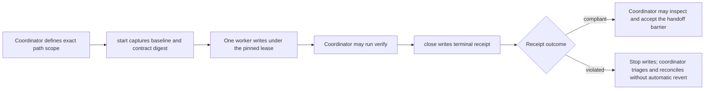

# Automatic write-lease guard

The automatic write-lease guard makes the machine-verifiable projection of a worker-first path contract enforceable. The complete semantic assignment lives in [`Milestone Assignment Packet v2`](./execplan-implementation-workflow.md#milestone-assignment-packet-v2); the guard pins its workflow identity, work-slice identity through `cycle_id`, correction-parent lineage, path scope, repository baseline, and Git control state. The primary coordinator captures that immutable projection immediately before each write turn and terminally closes the exact lease after that turn stops. A handoff barrier may advance only when closure returns a compliant receipt.

The guard is a repository workflow control. It validates the packet projection's attempt domain, worker/phase compatibility, terminal correction parent, matching guard identity and path scope, and single-child correction budget. It does not own or validate the packet's objective, authorities, commands, expected behavior, correction reason, dependencies, external side effects, cleanup, or stop conditions. It also does not decide whether a test is valid, prove product behavior, replace review, isolate operating-system permissions, or identify which process made a change. It never resets, restores, stages, commits, deletes, or otherwise repairs repository work.

The dependency-free Python implementation is repository workflow tooling, not application source, a product test harness, or completion evidence for any roadmap task. Python does not select or modify the MVP application toolchain governed by RD-002; end users do not need it to run the future TypeScript application.

Guarded implementation requires Git and Python 3.10 or newer on the development host. Research, decision, planning, and read-only review can still operate without Python. A write-authorized worker turn cannot claim this full guarded workflow without the lease tool; stop and obtain the prerequisite or record and approve a replacement control instead of silently downgrading to an unenforced manual lease.

## Lifecycle



Only one worker lease may be active in one Git worktree. Independent work can use separate Git worktrees with separate baselines. One persistent test or selected implementation agent may receive multiple sequential assignments inside a work slice, but persistence never extends a lease: the agent cannot write between turns, and every follow-up needs a new lease ID, fresh baseline, digest, and terminal close. The coordinator first drafts the semantic packet, starts the guard from its exact identity and path projection, inserts the returned digest, verifies that both representations match, and then sends the complete packet to the worker. The worker never invokes the guard or edits its runtime records. Read-only test-worker preflight has no lease and authorizes no writes. The bounded coordinator test-correction exception also occurs only when no lease is active; because the guard does not cover it, the ExecPlan record, focused validation, evidence invalidation, and test-boundary re-acceptance are mandatory before a later Green lease.

## Commands

Run commands from the repository root in PowerShell. The identifiers and paths below are illustrative; replace them with the active M1-03 ExecPlan packet's real work-slice identity and allowed or forbidden paths after RD-002 establishes the physical application layout. `start` emits JSON; retain its `contract_digest` exactly:

```powershell
$lease = python -B .codex\leases\lease_guard.py start `
  --workflow-id M1-03-20260828-01 `
  --task-id M1-03 `
  --cycle-id M1-03-20260828-01-slice-01 `
  --lease-id M1-03-20260828-01-slice-01-red-01 `
  --phase red `
  --attempt 1 `
  --owner test-worker-01 `
  --agent-type test_worker `
  --allow-file src/scanner/exact-three-rule-scan.test.ts `
  --allow-dir-root src/scanner/test-fixtures `
  --forbid-dir-root src/generation `
  --forbid-dir-root docs | ConvertFrom-Json

$leaseDigest = $lease.contract_digest
```

The coordinator may inspect a nonterminal result without accepting the handoff:

```powershell
python -B .codex\leases\lease_guard.py verify `
  --lease-id M1-03-20260828-01-slice-01-red-01 `
  --contract-digest $leaseDigest
```

After the worker stops, terminally close the lease:

```powershell
$closeResult = python -B .codex\leases\lease_guard.py close `
  --lease-id M1-03-20260828-01-slice-01-red-01 `
  --contract-digest $leaseDigest | ConvertFrom-Json
$closeExit = $LASTEXITCODE

if ($closeExit -ne 0 -or $closeResult.status -ne "closed-compliant" -or $closeResult.already_closed) {
  throw "The lease did not produce a fresh compliant closure."
}
```

`status` validates the pinned contract and reports whether a receipt exists. For a closed lease, `terminal_receipt` preserves the immutable closure outcome while `post_close_drift`, `post_close_drift_details`, and `current_changes_from_baseline` describe later repository movement. Post-close drift exits nonzero without rewriting the receipt:

```powershell
$statusResult = python -B .codex\leases\lease_guard.py status `
  --lease-id M1-03-20260828-01-slice-01-red-01 `
  --contract-digest $leaseDigest | ConvertFrom-Json
$statusExit = $LASTEXITCODE
```

If `close` reports `already_closed: true`, it returns nonzero because it replayed an existing receipt rather than performing fresh verification. It may release only a stale active pointer matching that receipt. Before accepting the original receipt, require `$statusExit -eq 0`, `$statusResult.status -eq "closed-compliant"`, and `$statusResult.post_close_drift -eq $false`.

Run the isolated standard-library test packet without touching the current repository state:

```powershell
python -B .codex\leases\lease_guard.py self-test
```

The isolated suite checks assignment identity at both trust boundaries and correction lineage at start: invalid attempts and worker/phase pairs fail before `start` creates state; a digest-valid stored contract with an invalid assignment identity fails when reloaded; and missing, unknown, nonterminal, mismatched, valid, and duplicate correction-parent cases are exercised. These remain grouped checks in the 27-check suite.

All commands return one JSON object. Exit `0` means the requested operation is valid and compliant. Exit `1` means verified noncompliance for the requested view: an active or terminal violation, or post-close drift. Exit `2` means invalid command input. Exit `3` means missing, replayed, conflicting, malformed, tampered, unstable, or otherwise unverifiable guard or Git state. Inspect the JSON fields rather than interpreting the code alone. Every nonzero result freezes workflow advancement until the coordinator triages it.

## Scope rules

- `start` accepts attempts `1` and `2`. Attempt 1 must not name a correction parent. Attempt 2 must pass `--correction-parent-lease-id` naming one terminal attempt-1 lease; workflow, task, work slice, phase, worker role, and path scope must match, and that parent may have only one attempt-2 child. The guard enforces this bounded lineage but does not decide whether the semantic packet remains unchanged, whether a replacement agent instance is authorized, or whether the correction is otherwise justified.
- `start` permits `test_worker` phases `red` or `evidence`, `code_worker` phases `setup` or `green`, and only the `green` phase for `frontend_code_worker`; values are lowercase and case-sensitive. The work-slice workflow uses `evidence` for a passing characterization, `red` for a missing or regressed contract, `setup` for independent standard-profile setup, and `green` for implementation plus optional same-turn Refactor. There is no standalone Refactor or implementation-worker evidence lease. The frontend role remains restricted to the conditional `frontend-visual` Green route; the semantic profile and visual capsule stay in the packet because the guard validates only worker/phase compatibility.
- `--allow-file` matches one exact repository-relative path. An existing endpoint must be an ordinary file; a missing endpoint may be created as a file during the lease.
- `--allow-dir-root` matches the named directory and descendants on path-component boundaries. `src` never matches `src2`. An existing root must be an ordinary directory, and a root created during the lease must remain a directory.
- `--forbid-file` and `--forbid-dir-root` use the same matching rules and always override an allowed scope.
- A named scope that Git already ignores is rejected because its endpoint cannot be verified. Ignored descendants inside an otherwise observable directory root remain outside the proof boundary; use narrow source scopes and never rely on the guard to constrain generated ignored output.
- Repeat an option to name multiple paths. Use `/` as the portable separator. Globs, absolute paths, drive-relative paths, empty components, traversal, `.git`, and the guard runtime directory are rejected. On Windows, control characters, alternate-data-stream colons, trailing periods or spaces, and reserved device basenames are also rejected.
- A rename is conservatively observed as deletion plus creation. Both endpoints must be allowed and neither may be forbidden.
- Windows ASCII path comparison is case-insensitive and non-expanding; non-ASCII spelling remains exact so Unicode folding cannot authorize a different endpoint. Case-colliding observed paths fail closed.
- The worker may not stage or commit. Logical Git-index content or flag drift, `HEAD` object drift, and symbolic branch/detachment drift are violations even when worktree bytes remain allowed.
- Ignore controls are frozen because changing them could hide new files from the endpoint scan. Every tracked `.gitignore` and every applicable `.gitignore` below a non-ignored parent is sealed even when it ignores itself. Controls below a parent that Git already ignores remain outside the proof boundary. A sealed `.gitignore`, `.git/info/exclude`, explicit `core.excludesFile`, effective implicit XDG/HOME global excludes file, or relevant Git setting change is a violation even when the file path was listed as allowed. Legitimate ignore maintenance is an exceptional coordinator edit performed and recorded between worker leases.
- Existing symbolic links, junctions, or reparse points in a scope or a non-ignored scanned endpoint fail closed. The fixed runtime path, each lease directory, and contract, receipt, and active-pointer endpoints must retain ordinary topology. Gitlinks, submodules, nested repositories, and special files are unsupported rather than partially verified.

The baseline includes Git-tracked files and untracked, non-ignored files. It hashes working-tree endpoint content rather than comparing only with `HEAD`, so a second change to a file that was already dirty before the worker started is still detected.

## Terminal results and recovery

A fresh compliant `close` writes an immutable receipt, releases the worktree's active pointer, and permits coordinator inspection of the assigned barrier. A successful command does not make the barrier correct by itself; the coordinator still reviews the actual diff and command evidence. Repeating the same pinned `close` is state-safe but returns nonzero with `closed-replayed`; it does not freshly validate the worktree. If receipt publication succeeded but active-pointer release failed, that retry may release only its matching stale pointer, after which pinned `status` must confirm the original compliant receipt and absence of post-close drift.

A terminal receipt can support reuse of separately recorded validation evidence only while pinned `status` confirms no post-close drift and the workflow also confirms the same command, working directory, relevant-tree fingerprint, and environment fingerprint. The guard does not record or verify command output, filesystem contents outside the lease, browser state, model-runtime state, provider responses, network responses, clock state, or another mutable external dependency. Treat such evidence as non-reusable unless an isolated run identity and state are pinned outside the guard.

A policy violation writes a terminal `violated` receipt, releases the active pointer, and exits nonzero. The coordinator freezes writes, identifies the unexpected, forbidden, concurrent, index, `HEAD`, or ignore-control change, and decides whether the work stops, becomes a corrected assignment, or needs owner direction. The guard never makes that semantic decision, attributes a writer, or reverts the change. Any later assignment starts only after reconciliation and uses a new lease ID and fresh baseline; never reuse or redefine the prior lease.

An integrity or inspection error may be retried only after the underlying state is stable and understood. Controlled `start` failures attempt to remove their unpublished contract directory and matching reservation, but the current CLI does not attest that rollback in its error output. If `start` is interrupted or does not return a valid `started` object and contract digest, do not spawn a worker or reuse the ID: the state is ambiguous. Once `start` returns a digest, never reuse or redefine that lease ID. The CLI intentionally has no force-recovery command. Do not bypass a wrong digest, rewrite runtime JSON, or delete a live pointer merely to continue. Irrecoverably missing, tampered, or ambiguous active state requires separately authorized coordinator recovery recorded in the ExecPlan before any replacement baseline.

## State, privacy, and proof boundary

Runtime data lives under the already ignored `logs/agent-flow-leases/v2/` directory. A guard contract stores identifiers including owner, attempt, and nullable correction-parent lease ID, normalized scope, repository identity, `HEAD` object and symbolic reference, Git-control digests, path names, and SHA-256 content digests. It intentionally does not store the correction reason, the full Milestone Assignment Packet, prompts, messages, command output, secrets, or file contents. Contracts and receipts are write-once and digest-pinned; this is tamper-evident workflow state, not an operating-system security boundary against a malicious same-user process.

The guard proves net endpoint state between baseline and inspection. It cannot prove that a file was changed and restored byte-for-byte before closure. Ignored descendants, empty directory creation, Windows alternate data streams, access-control lists, extended attributes, and targets outside the worktree are outside its proof boundary. Concurrent forbidden or unleased endpoint changes and scan-time movement fail closed, but a concurrent process that leaves only an allowed net endpoint state is indistinguishable from the assigned worker and cannot be attributed. Unsupported path types or a tree that changes during inspection fail closed.

Lease closure is the workflow's machine-enforced path-ownership evidence for worker turns. It remains subordinate to semantic validation, coordinator inspection, independent review, and the task-closure gate.

## Related policy

- [Worker-first ExecPlan implementation workflow](./execplan-implementation-workflow.md)
- [Project-scoped agent guide](./README.md)
- [ExecPlan convention](../PLANS.md)
- [Repository instructions](../AGENTS.md)
- [ADR-0024: Milestone-slice TDD with independent ownership](../docs/architecture/decisions/ADR-0024-milestone-slice-tdd-with-independent-ownership.md)
- [Development roadmap](../docs/DEVELOPMENT_ROADMAP.md)
