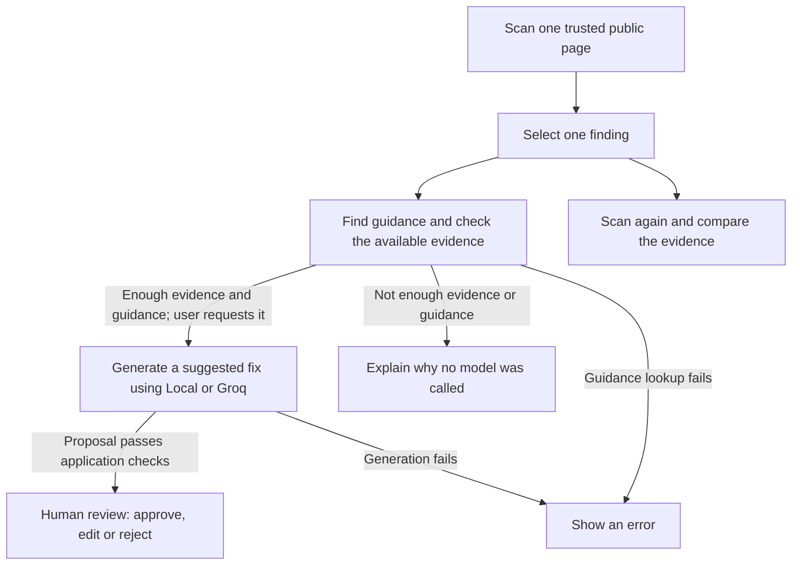

# A11y Evidence Lab

## Overview

A11y Evidence Lab helps frontend developers investigate accessibility issues and decide how to fix them using recorded evidence and published guidance. It scans a page, looks up guidance, offers AI-generated suggestions for human review, and compares results from a later scan.

For AI suggestions, **Local mode** runs a model on your computer. **Groq mode** uses an external AI service. You choose the mode before scanning; the app never switches modes automatically.

This portfolio's **minimum viable product (MVP)** analyzes one trusted public HTTPS page at a time. It uses exactly three axe-core checks: `image-alt`, `label`, and `color-contrast`. Choose only pages you have permission to analyze and that contain no sensitive information.

The app does not crawl websites, access pages that require a login, or change source code. It cannot certify accessibility or determine legal compliance. It is not designed to safely handle malicious pages.

## Start here

For a first look, follow this reading order:

1. [Understand the workflow](#why-this-matters): what the app helps you do.
2. [Run it locally](docs/DEVELOPMENT.md): prerequisites and startup commands.
3. [Follow one example](docs/APPLICATION_GUIDE.md#walkthrough-a-form-field-without-a-label): from a missing form label to human review and a later comparison. You can read it without running the app.
4. [See the architecture](docs/architecture/SYSTEM_ARCHITECTURE.md): local components, external connections and data flow.
5. [Read the evidence and limits](docs/BOUNDED_MVP_EVIDENCE.md): what the recorded checks establish and where results fell short.

## Why this matters

A scanner can flag an issue, but a developer still needs to understand the evidence, choose a suitable fix, and decide what to check manually. A11y Evidence Lab connects those steps:

1. Scan a page and inspect the reported issues, called **findings**. Checks the scanner could not decide automatically appear separately.
2. Select a finding and search a fixed collection of accessibility guidance from the World Wide Web Consortium (W3C).
3. Ask the AI for a suggested fix with references to that guidance. If required evidence is incomplete, or guidance is missing, incomplete or conflicting, the app explains why it cannot generate a suggestion and does not call a model. Errors are shown separately.
4. Review a proposal that passed the application's checks, then approve it, edit and accept it, or reject it.
5. Choose to scan the page again and compare the evidence. Uncertain matches remain uncertain; a comparison does not prove that the whole page is accessible. You can compare scans without first generating or reviewing a proposal.

The [project concept](docs/PROJECT_CONCEPT.md#basic-implementation-flow) explains the workflow, the checks at each step, and the engineering goals in more detail.

## Project status

The app implements scanning, local storage of results, guidance lookup and AI suggestions for one finding at a time, human review, and saved scan comparisons. The [development roadmap](docs/DEVELOPMENT_ROADMAP.md) records task completion. The [MVP evidence report](docs/BOUNDED_MVP_EVIDENCE.md) explains what was verified and its limitations; the [task plans](docs/plans/README.md) contain the detailed records.

In the fixed evaluation, six AI proposals passed the application's format and validation checks. Some claims still lacked support, and some suggested fixes were unsuitable. Finding all required types of guidance does not guarantee that the guidance is relevant to the issue.

**The MVP workflow is implemented; the correctness and usefulness of each AI suggestion still need human assessment.** Application validation checks the required structure and rules. Semantic assessment checks whether the claims make sense, are supported by the evidence, and address the actual issue.

These results do not prove whole-page accessibility, compatibility with other models or hardware, or readiness for public release. Browsing saved runs, installers, and security work needed for production use remain outside the MVP.

## Technology

| Area | Implementation |
| --- | --- |
| Browser interface | React and TypeScript, built with Vite |
| Local service | Node.js and TypeScript; manages local files, checks data and sends model requests |
| Accessibility scanning | Playwright with a fixed Chromium version and axe-core |
| Guidance search | LangChain MemoryVectorStore compares numerical representations of text, called embeddings; EmbeddingGemma creates them locally through Ollama to rank guidance passages by similarity |
| AI suggestions | Qwen through Ollama in Local mode, or the fixed Groq API connection; the app never switches providers automatically |

Exact dependency versions are recorded in [package.json](package.json) and [package-lock.json](package-lock.json). The [architecture decisions](docs/architecture/decisions/README.md) explain the choices and where they apply.

## Getting started

The documented setup uses:

- **Windows and PowerShell 7**.
- **Node.js 24.20.0 and npm 11.19.0**, matching [package.json](package.json).
- **Git and a Git clone with its `.git` folder**. The app reads its code version from Git at startup, so downloading a source ZIP is not enough.
- **Chrome or Edge** to use the interface. First-time setup also downloads the project dependencies and a separate Chromium browser for scanning.

You start the app on your computer and use it in a browser. Follow the [local startup guide](docs/DEVELOPMENT.md) in order:

1. Install the project dependencies and scanner browser, then build the interface.
2. Run the startup commands in PowerShell.
3. Open the address printed by the server in Chrome or Edge.

If setup is already complete, go straight to [Start the application](docs/DEVELOPMENT.md#start-the-application).

Scanning needs no AI model. To search for guidance in either mode, install Ollama and the `embeddinggemma` model yourself. Local AI suggestions also require `qwen3.5:4b`; Groq suggestions require an API key configured in the local service. Follow [provider setup and application use](docs/APPLICATION_GUIDE.md) for the required versions and instructions.

## Documentation

The [documentation index](docs/README.md) lists all guides and explains which documents define requirements, decisions and project status.

| Guide | Contents |
| --- | --- |
| [Run the project locally](docs/DEVELOPMENT.md) | First-time setup, everyday startup, stopping, troubleshooting, and a [repository map](docs/DEVELOPMENT.md#repository-map) |
| [Maintainer verification reference](docs/DEVELOPMENT_REFERENCE.md) | Full test instructions, command setup, and deletion of saved runs |
| [Application workflow and API reference](docs/APPLICATION_GUIDE.md) | A [synthetic example walkthrough](docs/APPLICATION_GUIDE.md#walkthrough-a-form-field-without-a-label), user actions, APIs, and provider setup |
| [System architecture](docs/architecture/SYSTEM_ARCHITECTURE.md) | Component and data-flow diagrams, responsibilities, storage, and local/external boundaries |
| [Evaluation and evidence inspection](docs/EVALUATION_GUIDE.md) | Fixed evaluation inputs, saved results, and instructions for inspecting them without changes |
| [Guidance collection and source notices](docs/CORPUS.md) | How the W3C guidance is organized and checked, with attribution and full license notices |
| [Project concept](docs/PROJECT_CONCEPT.md) and [requirements](docs/PROJECT_REQUIREMENTS.md) | Product goals, detailed workflow, agreed scope, and limits |
| [Architecture decisions](docs/architecture/decisions/README.md) | Technology choices and where they apply |

## License

Project-authored code and documentation use the [MIT License](LICENSE). Text from W3C guidance keeps its [source-specific attribution and full license notices](docs/CORPUS.md#closed-corpus-notices).

Links to sections moved from this README

These links keep older documentation, saved source references, and bookmarks working. Follow each link to the current guide.

- [Engineering objective](docs/PROJECT_CONCEPT.md#engineering-objective)
- [Planned MVP startup and generation setup](docs/DEVELOPMENT_REFERENCE.md#planned-mvp-startup-and-generation-setup)
- [Planned workflow](docs/PROJECT_CONCEPT.md#possible-user-flow)
- [Development toolchain](docs/DEVELOPMENT_REFERENCE.md#development-toolchain)
- [Development command preparation](docs/DEVELOPMENT_REFERENCE.md#development-command-preparation)
- [Build and verify the walking skeleton](docs/DEVELOPMENT_REFERENCE.md#build-and-verify-the-walking-skeleton)
- [Run the local service](docs/DEVELOPMENT.md#start-the-application)
- [Retained runs and deletion](docs/DEVELOPMENT_REFERENCE.md#retained-runs-and-deletion)
- [Current scope](docs/APPLICATION_GUIDE.md#current-scope)
- [Intentional rescans](docs/APPLICATION_GUIDE.md#intentional-rescans)
- [Internal comparison](docs/APPLICATION_GUIDE.md#internal-comparison)
- [Shared generation APIs](docs/APPLICATION_GUIDE.md#shared-generation-apis)
- [Proposal review APIs](docs/APPLICATION_GUIDE.md#proposal-review-apis)
- [Reviewing one proposal](docs/APPLICATION_GUIDE.md#reviewing-one-proposal)
- [Fixed Local Qwen adapter](docs/APPLICATION_GUIDE.md#fixed-local-qwen-adapter)
- [Fixed Groq adapter](docs/APPLICATION_GUIDE.md#fixed-groq-adapter)
- [Frozen generation evaluation package](docs/EVALUATION_GUIDE.md#frozen-generation-evaluation-package)
- [Inspecting M6-02 generation evidence](docs/EVALUATION_GUIDE.md#inspecting-m6-02-generation-evidence)
- [Closed corpus snapshot](docs/CORPUS.md#closed-corpus-snapshot)
- [Inspecting M2-02 retrieval evidence](docs/EVALUATION_GUIDE.md#inspecting-m2-02-retrieval-evidence)
- [Inspecting generation for one Finding](docs/APPLICATION_GUIDE.md#inspecting-generation-for-one-finding)
- [Inspecting M2-04 checkpoint evidence](docs/EVALUATION_GUIDE.md#inspecting-m2-04-checkpoint-evidence)
- [Closed corpus notices](docs/CORPUS.md#closed-corpus-notices)
- [W3C Document License — 2023](docs/CORPUS.md#w3c-document-license--2023)
- [W3C Software and Document License — 2023](docs/CORPUS.md#w3c-software-and-document-license--2023)

