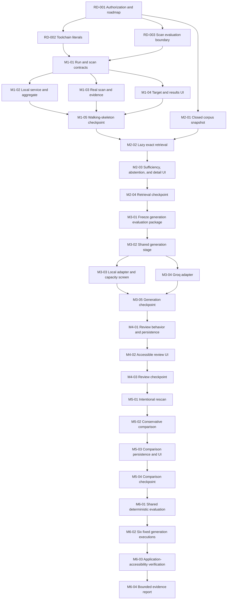

# Development roadmap

## Status and authority

- **Repository stage:** Development ready
- **Roadmap status:** Accepted implementation sequence on 2026-08-28 through OD-025
- **Implementation status:** Not started
- **Current task in progress:** None
- **Scope:** The accepted local portfolio MVP only

This roadmap turns the accepted planning baseline into an implementation order. It owns milestone order, task dependencies, integration checkpoints, and progress status. It does not create or override a product requirement, architecture decision, behavioral contract, evaluation result, or release claim. If this roadmap conflicts with an identified requirement or Accepted ADR, the requirement or ADR controls and the roadmap must be corrected.

The controlling sources are the [project requirements](PROJECT_REQUIREMENTS.md), [delivery-readiness decisions](requirements/DELIVERY_READINESS_AND_OPEN_DECISIONS.md), applicable focused requirement modules, [Accepted ADRs](architecture/decisions/README.md), the [evaluation authority](requirements/evaluation-and-release/EVALUATION_AND_ACCEPTANCE.md), and the derived [Gherkin specifications](specs/README.md). Candidate assessments remain Proposed research. `Accepted for evaluation` does not mean implemented, generally supported, or release-qualified.

Progress labels in this document mean:

- **Complete:** the task's stated verification evidence exists.
- **In progress:** a concrete user request selected the task and work has started.
- **Not started:** no implementation claim is made.
- **Blocked:** an identified prerequisite or governing decision prevents work.

Only `RD-001` is Complete. Every implementation task is Not started.

For dependency readiness, `RD-002`, `RD-003`, and `M2-01` are **Ready** because RD-001 is Complete. Every other Not started task is **Blocked** by the dependencies named in its task entry and becomes Ready only when all of them are Complete. Each task entry also states whether it is on the mandatory dependency spine or belongs to a named safe parallel group.

## Implementation strategy

The MVP is one portfolio slice delivered through progressively complete vertical milestones, not six generalized subsystems. Each milestone adds one observable user capability across only the contracts, service behavior, persistence, UI, validation, and verification needed for that capability. Narrow enabling tasks are allowed only when the next milestone immediately consumes their output.

The first milestone is a real scan-to-evidence walking skeleton. Later milestones add curated retrieval and abstention, structured generation, human review, and conservative comparison; the final gate performs bounded evaluation. Application accessibility is built into each UI task and verified again at that final evaluation gate.

The roadmap applies YAGNI throughout: direct application-owned logic, one local service, one versioned `run.json` aggregate per run, sequential work on one selected Finding, a closed corpus, and exactly two fixed generation modes. No task introduces a crawler, workflow engine, queue, database, generic provider registry, or release platform.

## Bounded MVP outcome

When the roadmap is complete, a frontend developer can:

1. Start the developer-managed local service and open its loopback UI.
2. Enter one trusted, non-authenticated public HTTPS page, select one global Local or Groq mode, and run one provider-independent scan of exactly `image-alt`, `label`, and `color-contrast`.
3. See every returned violation node as an independent Finding and native `incomplete` nodes as distinct scanner-review observations, with minimized evidence and visible scan limitations.
4. Select one Finding, retrieve at most three cited passages from the closed versioned corpus, and receive either a deterministic abstention or eligibility for generation.
5. Explicitly generate one validated proposal through only the run's selected provider, with no mixing, batching, implicit call, retry, or fallback.
6. Approve, edit and accept, or reject that proposal independently.
7. Start a later scan from any retained baseline Finding and inspect a conservative comparison.

The result demonstrates a bounded RAG and human-review workflow. It does not certify accessibility, establish legal compliance, modify source code, qualify a provider, or establish production readiness.

## Authority location key

Every task's **Authorities** field uses stable identifiers from the owning sources below. Use this table to resolve those identifiers, then read only the rows, decisions, or scenarios named by the selected task.

| Identifier family | Owning source |
| --- | --- |
| `OD-*` | [Delivery readiness and open decisions](requirements/DELIVERY_READINESS_AND_OPEN_DECISIONS.md) |
| `REQ-AUTH-*`, `REQ-SCAN-*`, `REQ-EVID-*`, `REQ-CORP-*`, `REQ-RETR-*`, `REQ-GEN-*`, `REQ-REV-*`, `REQ-COMP-*`, `REQ-UX-*` | [Evidence and review workflow](requirements/EVIDENCE_AND_REVIEW_WORKFLOW.md) |
| `REQ-LLM-*` | [Generation provider execution](requirements/generation-provider-and-model-lifecycle/GENERATION_PROVIDER_EXECUTION.md) |
| `REQ-INST-*` | [Installation and model lifecycle](requirements/generation-provider-and-model-lifecycle/INSTALLATION_AND_MODEL_LIFECYCLE.md) |
| `REQ-A11Y-*` | [Application accessibility](requirements/quality-security-and-operations/APPLICATION_ACCESSIBILITY.md) |
| `REQ-SEC-*` | [Privacy and security](requirements/quality-security-and-operations/PRIVACY_AND_SECURITY.md) |
| `REQ-QUAL-*` | [Reliability, reproducibility, and operations](requirements/quality-security-and-operations/RELIABILITY_REPRODUCIBILITY_AND_OPERATIONS.md) |
| `REQ-EVAL-*` | [Evaluation and acceptance](requirements/evaluation-and-release/EVALUATION_AND_ACCEPTANCE.md) |
| `ADR-*` | [Architecture Decision Record index](architecture/decisions/README.md), which links every current and superseded record |
| `BHV-*` | [Evaluation and acceptance — Derived behavioral scope](requirements/evaluation-and-release/EVALUATION_AND_ACCEPTANCE.md#derived-behavioral-scope) |
| `SPEC-*` | [Observable MVP specification](specs/SPEC.feature) |
| `HS-*` | [Hard-boundary MVP specification](specs/HARD_SPEC.feature) |

## Entry and freeze tasks

### RD-001 — Record development authorization and roadmap governance

- **Parent milestone / role / status:** Repository entry gate / enabling / **Complete**.
- **Objective:** Move the repository from idea exploration to development ready and establish one derived implementation sequence.
- **Inputs, dependencies, and scheduling:** Depends on the accepted MVP requirements and ADRs through OD-024; completed by OD-025 and the repository-status updates made with this roadmap.
- **Expected output:** Consistent status authorities, this roadmap, and an explicit rule that implementation begins only through a concrete user-requested roadmap task.
- **User-visible outcome:** No application behavior; the project is ready for a focused implementation request.
- **Authorities:** OD-025 and [Project requirements — Document status](PROJECT_REQUIREMENTS.md#document-status).
- **Verification:** Repository instructions, requirements status, delivery readiness, public status, and this roadmap agree that development is ready and implementation has not started.
- **Likely surfaces:** `AGENTS.md`, repository and documentation indexes, project status summaries, and this roadmap.
- **Out of scope:** Code, dependencies, fixtures, tests, implementation scaffolding, release authorization, and promotion of Proposed or Deferred work.

### RD-002 — Select the minimum development toolchain literals

- **Parent milestone / role / status:** Walking-skeleton entry / enabling / **Not started**.
- **Objective:** Select only the JavaScript runtime, package manager, build arrangement, local-service host, and exact dependency versions required by M1.
- **Inputs, dependencies, and scheduling:** Ready after completed RD-001. It is on the critical dependency path and must complete before scaffolding. A durable architecture consequence requires an ADR; ordinary implementation literals do not.
- **Expected output:** One small, reproducible development baseline compatible with the recorded TypeScript, React, localhost-service, Playwright, and axe-core decisions at their existing statuses.
- **User-visible outcome:** Enables the developer to start the future service and UI; it creates no product capability by itself.
- **Authorities:** ADR-0008, ADR-0009, ADR-0011, ADR-0012, ADR-0015, `REQ-INST-002`, `REQ-QUAL-010`, and `REQ-QUAL-012`.
- **Verification:** Every selected tool is needed by M1, versions can be pinned, and no installer, desktop wrapper, database, hosted service, or generalized framework enters scope.
- **Likely surfaces:** Future package metadata, TypeScript/build configuration, local-service and UI entry points, and development instructions.
- **Out of scope:** Package upgrades unrelated to M1, production deployment, distribution, component inventories, release locks, and framework selection for hypothetical later needs.

### RD-003 — Freeze the walking-skeleton evaluation boundary

- **Parent milestone / role / status:** Walking-skeleton entry / validation / **Not started**.
- **Objective:** Fix the smallest M1 literals needed to implement and verify exact-three-rule scanning without prematurely freezing generation details.
- **Inputs, dependencies, and scheduling:** Ready after completed RD-001 and may proceed in parallel with RD-002. It joins RD-002 before M1-01.
- **Expected output:** Controlled failing/corrected fixture content, expected native outcomes, stable target keys, pinned browser/rule profile, readiness condition, finite timeout, locator representation, and rule-specific minimized evidence allowlists.
- **User-visible outcome:** Enables a reproducible scan and evidence result; it creates no runtime behavior by itself.
- **Authorities:** OD-003, OD-009, OD-021, OD-024, `REQ-SCAN-002`, `REQ-SCAN-005`, `REQ-EVID-002`, `REQ-EVAL-004`, `REQ-EVAL-005`, and the [evaluation freeze boundary](requirements/evaluation-and-release/EVALUATION_AND_ACCEPTANCE.md#freeze-boundary).
- **Verification:** The three controlled profiles have unambiguous expected failing and corrected results, while generation packages, model outputs, and release claims remain outside this freeze.
- **Likely surfaces:** Future controlled fixtures, compact evaluation manifest, scanner configuration, evidence contracts, and implementation notes.
- **Out of scope:** A crawler fixture, broad WCAG coverage, adversarial-page corpus, exact prompt/output contract, statistical rubric, or provider comparison.

## Dependency graph

M5 is semantically dependent only on completed scan evidence from M1. It is sequenced after M4 because review and comparison both extend the same `run.json` aggregate and React detail boundary; this avoids unsafe parallel edits. It may move earlier only after a focused execution plan proves those shared contracts are frozen and the work does not overlap.

## M1 — Scan-to-evidence walking skeleton

**Milestone status:** Not started.

**Observable milestone outcome:** A developer starts the local application, enters one supported trusted URL and one global provider mode, activates **Analyze**, and sees a complete persisted list of all Findings and distinct scanner-review observations from the exact three-rule scan—or a bounded failure that cannot be mistaken for zero findings. Reloading can reopen that run. No retrieval or provider call occurs.

### M1-01 — Define the minimum run and scan contracts

- **Parent milestone / role / status:** M1 / contract / **Not started**.
- **Objective:** Define the minimum runtime-validated PageAnalysisRun, Finding, ScannerReviewObservation, scan coverage, provider-context, lifecycle, and failure shapes consumed immediately by M1.
- **Inputs, dependencies, and scheduling:** Depends on RD-002 and RD-003; critical path. M1-02, M1-03, and M1-04 may begin only after this contract is stable.
- **Expected output:** One bounded contract with exactly `running`, `completed`, or `failed` parent-run status, immutable completed scan evidence, independent nested Findings, distinct native incomplete observations, and one immutable mode context that is not a ProviderInvocation.
- **User-visible outcome:** Enables correct results, failure, mode, and reopen behavior.
- **Authorities:** `REQ-LLM-002`, `REQ-SCAN-005`–`REQ-SCAN-007`, `REQ-EVID-003`, `REQ-EVID-007`–`REQ-EVID-011`, `REQ-QUAL-001`, `REQ-QUAL-010`–`REQ-QUAL-012`, `REQ-QUAL-019`, ADR-0021, BHV-01, and BHV-07.
- **Verification:** The contract can represent complete nonzero, valid zero, native incomplete observations, parent failure, missing individual evidence facts, and immutable run-level Local/Groq context without adding child-record identities.
- **Likely surfaces:** Future domain types, runtime validators, scanner boundary, local API contracts, and `run.json` format.
- **Out of scope:** Retrieval, proposal, review, comparison, migration framework, generated schema system, and generalized workflow state machine.

### M1-02 — Establish the loopback service and single-file aggregate

- **Parent milestone / role / status:** M1 / service and persistence / **Not started**.
- **Objective:** Provide the minimum application-owned boundary for service startup/shutdown and for creating, durably writing, validating, and reopening one local run aggregate.
- **Inputs, dependencies, and scheduling:** Depends on M1-01. Safely parallelizable with M1-03 and M1-04 only while the shared contract remains unchanged; all join at M1-05.
- **Expected output:** A loopback-only service that reports ready or bounded startup failure, has a clean stop path, owns privileged work, separates service-owned AI configuration from run-mode selection without probing a provider, permits at most one user-requested operation at a time without a queue, and manages one `data/runs/<run-id>/run.json` repository with safe writes and read validation.
- **User-visible outcome:** Service readiness/failure is understandable; a completed run can survive reload and reopen; persistence or busy-operation failure is visible.
- **Authorities:** `REQ-INST-002`, `REQ-INST-004`, `REQ-EVID-003`, `REQ-EVID-011`, `REQ-SEC-002`, `REQ-SEC-006`, `REQ-SEC-027`, `REQ-QUAL-002`, `REQ-QUAL-005`, `REQ-QUAL-011`–`REQ-QUAL-013`, ADR-0015, ADR-0021, SPEC-007, and HS-006.
- **Verification:** The service demonstrates ready/startup-failed/clean-stop paths; browser code receives no filesystem or credential authority; configuration neither selects a mode nor invokes/probes a provider; a second user operation cannot overlap the current one; reopening validates the aggregate; a failed write cannot publish completed work; manual/developer deletion of a run is demonstrated by removing only its exact run directory and never the corpus; later nested updates cannot alter completed scan evidence or sibling data.
- **Likely surfaces:** Future local-service entry point, run repository, atomic-write/read boundary, loopback API, and run-loading UI route.
- **Out of scope:** Database, child files, Markdown report, search/history dashboard, backup, synchronization, migration platform, authentication, or multi-user access.

### M1-03 — Implement the real exact-three-rule scan and minimized evidence

- **Parent milestone / role / status:** M1 / service and validation / **Not started**.
- **Objective:** Execute the accepted Playwright/axe path and normalize the complete result into the M1 contract.
- **Inputs, dependencies, and scheduling:** Depends on M1-01 and the RD-003 literals. Safely parallelizable with M1-02 and M1-04 against the frozen contract; joins at M1-05.
- **Expected output:** Basic input rejection, one fresh non-persistent browser context, finite navigation, exact `image-alt`/`label`/`color-contrast` execution over the top-level document with iframe documents excluded, all-node collection, rule-specific minimization, coverage validation, cleanup, and bounded failures.
- **User-visible outcome:** The application can produce real deterministic Findings and separate native incomplete observations for one trusted page.
- **Authorities:** `REQ-AUTH-007`, `REQ-AUTH-008`, `REQ-SCAN-001`, `REQ-SCAN-005`–`REQ-SCAN-007`, `REQ-EVID-007`–`REQ-EVID-010`, `REQ-SEC-026`, ADR-0008, ADR-0009, ADR-0018, SPEC-001, HS-001, and HS-004.
- **Verification:** Malformed input, credentials in the URL, and unsupported schemes fail before run creation/navigation; the scan invokes no provider; every returned node is retained; complete zero requires all three rules; timeout/fatal failure cannot become partial success; browser resources close after success or failure.
- **Likely surfaces:** Future target validator, browser/scanner adapter, evidence normalizer, coverage validator, and scan-failure categories.
- **Out of scope:** Crawling, link discovery, authentication, private-target handling, iframe scanning, page interaction, downloads, broad axe rules, hostile-target qualification, screenshots, traces, raw HTML, or raw scanner archives.

### M1-04 — Present accessible target entry and complete results

- **Parent milestone / role / status:** M1 / UI / **Not started**.
- **Objective:** Project the M1 contract through the unprivileged React UI without creating a second state model.
- **Inputs, dependencies, and scheduling:** Depends on M1-01. Safely parallelizable with M1-02 and M1-03 against the frozen contract; joins at M1-05.
- **Expected output:** Keyboard-operable target and mode controls, Local visibly recommended, one concise mode-selection disclosure, a persistent exact provider/model label, one Analyze action, an ordinary single-operation busy guard, loading/failure/complete states, grouped Findings, distinct scanner-review observations, coverage and limitation text, and detail/reopen actions.
- **User-visible outcome:** The user understands Local versus Groq before the run, can start and understand the scan, distinguish findings from observations and failures, and reopen completed evidence.
- **Authorities:** `REQ-LLM-002`, `REQ-LLM-003`, `REQ-LLM-020`, `REQ-INST-004`, `REQ-SEC-005`, `REQ-UX-002`–`REQ-UX-005`, `REQ-UX-010`–`REQ-UX-012`, `REQ-QUAL-012`, `REQ-A11Y-001`–`REQ-A11Y-004`, `REQ-A11Y-009`, `REQ-A11Y-010`, ADR-0012, SPEC-001, SPEC-008, and HS-015.
- **Verification:** Local disclosure names approved loopback generation without an offline/zero-egress claim; Groq disclosure names Groq, `openai/gpt-oss-20b`, remote processing, and the permitted minimized evidence/guidance categories; selection performs no probe/call; status and source distinctions do not rely only on color; overlapping actions are unavailable with an accessible explanation; focus and errors are predictable; external content is never executable markup; limitations prohibit accessibility/compliance interpretations.
- **Likely surfaces:** Future target form, provider-mode control, run-status region, results list, Finding/observation summaries, detail view, and reopen route.
- **Out of scope:** Retrieval controls, Generate action, proposal/review UI, embedded target preview, chat, dashboard, settings, or bulk operations.

### M1-05 — Integrate and verify the walking skeleton

- **Parent milestone / role / status:** M1 / integration and verification / **Not started**.
- **Objective:** Join the service, scanner, persistence, and UI into the first real end-to-end user workflow.
- **Inputs, dependencies, and scheduling:** Depends on M1-02, M1-03, and M1-04. Critical-path integration checkpoint; M2-02 and dependent work cannot start until it passes.
- **Expected output:** One integrated scan-to-disk slice exercised against the controlled cases and one trusted public-page smoke target.
- **User-visible outcome:** The exact milestone outcome stated for M1 works end to end and can be demonstrated honestly.
- **Authorities:** `REQ-AUTH-007`, `REQ-AUTH-008`, `REQ-LLM-002`, `REQ-LLM-003`, `REQ-LLM-020`, `REQ-INST-002`, `REQ-INST-004`, `REQ-SCAN-001`, `REQ-SCAN-005`–`REQ-SCAN-007`, `REQ-EVID-003`, `REQ-EVID-007`–`REQ-EVID-011`, `REQ-SEC-005`, `REQ-SEC-006`, `REQ-UX-002`–`REQ-UX-005`, `REQ-UX-010`–`REQ-UX-012`, `REQ-QUAL-011`, `REQ-QUAL-012`, BHV-01, BHV-07, HS-001, HS-004, HS-006, OD-021, and OD-024.
- **Verification:** Demonstrate service readiness/failure/clean stop, valid nonzero, valid zero, native incomplete, malformed input, visible scan failure, durable reopen, the manual exact-directory deletion boundary, one-operation guarding, mode disclosure, configuration/selection separation, sibling preservation, cleanup, and no provider invocation. Include the applicable automated and keyboard checks rather than postponing accessible behavior.
- **Likely surfaces:** Integrated local application, controlled fixtures, focused verification artifacts, and development instructions.
- **Out of scope:** Claims about RAG, generation, provider readiness, review, comparison, hostile-URL safety, certification, or release readiness.

## M2 — Curated retrieval and deterministic abstention

**Milestone status:** Not started.

**Observable milestone outcome:** From a completed scan, the user selects one Finding, inspects its minimized evidence, retrieves inspectable versioned guidance with citations, and sees either `supported` eligibility or the correct terminal application-authored abstention. Retrieval execution/integrity failures remain failures rather than abstentions. No LLM is called.

### M2-01 — Prepare the authorized closed corpus snapshot

- **Parent milestone / role / status:** M2 / enabling and validation / **Not started**.
- **Objective:** Acquire and prepare exactly the accepted eight W3C artifacts under one reviewed, immutable corpus version.
- **Inputs, dependencies, and scheduling:** Depends on RD-001 and the accepted source pack. It may run in parallel with M1 because it does not change the run, scan, persistence, or UI contracts; it joins M1 at M2-02.
- **Expected output:** Source/use-condition review, manifest metadata, manually selected heading-aware passages, stable passage IDs, required guidance roles, rule/SC mappings, conflict declarations, and gold passage mappings for the three controlled profiles.
- **User-visible outcome:** Enables exact, attributable guidance inspection; no runtime behavior by itself.
- **Authorities:** `REQ-CORP-001`, `REQ-CORP-003`–`REQ-CORP-007`, `REQ-EVAL-003`–`REQ-EVAL-005`, and ADR-0022.
- **Verification:** Exactly eight approved artifacts are represented; URLs, publisher, status/version, section, attribution, copyright/use conditions, corpus version, and stable passage identities resolve; no automatic crawl, refresh, or generic splitting occurs.
- **Likely surfaces:** Future corpus manifest, permitted local source snapshot, deterministic passage data, and evaluation gold mapping.
- **Out of scope:** Web search, corpus crawling, arbitrary uploads, automatic refresh, broad WCAG corpus, generic document ingestion, legal conclusion, reranking, or vector database.

### M2-02 — Implement lazy local exact-vector retrieval

- **Parent milestone / role / status:** M2 / service and integration / **Not started**.
- **Objective:** Retrieve guidance for one selected Finding through the accepted bounded LangChain role.
- **Inputs, dependencies, and scheduling:** Depends on M1-05 and M2-01. Critical path.
- **Expected output:** Attempt-time Ollama/EmbeddingGemma availability handling, first-request vector construction, in-process MemoryVectorStore, rule/SC filtering, exact cosine ranking, deterministic passage-ID tie-breaking, `k = 3`, and persisted retrieval provenance.
- **User-visible outcome:** One selected Finding returns up to three ranked passages with corpus version, section, source URL, passage identity, and score/order metadata.
- **Authorities:** `REQ-RETR-001`, `REQ-RETR-002`, `REQ-RETR-005`, `REQ-RETR-006`, `REQ-INST-003`, `REQ-INST-006`, `REQ-INST-017`, ADR-0006, ADR-0013, ADR-0019, ADR-0020, ADR-0022, ADR-0023, and SPEC-002.
- **Verification:** Startup performs no embedding work; only the selected Finding's privacy-safe query enters retrieval; vectors stay in process; no hosted embedding/vector service is used; missing setup produces a concise failure with official Ollama setup guidance; retrieval/integrity errors are bounded and preserve scan evidence.
- **Likely surfaces:** Future corpus loader, embedding adapter, in-memory retrieval component, Finding-to-query projection, retrieval validator, and nested aggregate update.
- **Out of scope:** Chroma, persistent vector service, hybrid search, reranking, agentic retrieval, web search, sibling Finding content, target URL, locator, or arbitrary page text in the query.

### M2-03 — Apply support states, abstention, and Finding-detail presentation

- **Parent milestone / role / status:** M2 / validation, service, and UI / **Not started**.
- **Objective:** Convert retrieval and evidence completeness into the accepted deterministic branch before any generation capability exists.
- **Inputs, dependencies, and scheduling:** Depends on M2-02; critical path.
- **Expected output:** Exact `supported`, `incomplete`, `missing`, and `conflicting` meanings; citation resolution; evidence-sufficiency evaluation; terminal abstention record and explanation; distinct retrieval-failure state; and selected-Finding detail UI.
- **User-visible outcome:** The user sees evidence and guidance as separate layers and receives either supported eligibility, a clear no-call abstention with manual-investigation guidance, or a visible retrieval failure.
- **Authorities:** `REQ-EVID-004`, `REQ-EVID-007`, `REQ-RETR-004`, `REQ-RETR-005`, `REQ-GEN-001`, `REQ-GEN-009`, `REQ-GEN-010`, BHV-02, BHV-03, SPEC-002, the abstention/failure branches of SPEC-003, and HS-008.
- **Verification:** Abstention occurs only for incomplete evidence or completed insufficient/conflicting guidance; it references available records, names the blocking information, confirms no provider call, proposes no remediation, creates no ProviderInvocation/review decision, and leaves siblings unchanged. Execution/integrity failure has no support state and is not called abstention.
- **Likely surfaces:** Future sufficiency policy, citation resolver, abstention builder, Finding detail, guidance list, status projection, and aggregate update.
- **Out of scope:** LLM invocation, fake proposal, approve/edit/reject review, provider probe, automatic retry, or combined Finding analysis.

### M2-04 — Integrate and verify retrieval and abstention

- **Parent milestone / role / status:** M2 / integration and verification / **Not started**.
- **Objective:** Prove the real closed-corpus path and deterministic no-call branch end to end.
- **Inputs, dependencies, and scheduling:** Depends on M2-03; critical-path checkpoint before M3-01.
- **Expected output:** Integrated selected-Finding retrieval, citation inspection, supported eligibility, abstention, and failure demonstrations persisted in the single aggregate.
- **User-visible outcome:** The M2 milestone outcome works without any generation provider.
- **Authorities:** `REQ-EVAL-002`–`REQ-EVAL-005`, BHV-02, BHV-03, SPEC-002, SPEC-003, HS-006, and HS-008.
- **Verification:** Exercise the frozen gold passage for each controlled profile, the shared `incomplete` abstention package, zero-applicable/missing, declared-conflict, execution failure, and passage-integrity failure without corrupting completed scan evidence.
- **Likely surfaces:** Integrated retrieval flow, controlled evaluation inputs, focused verification artifacts, and accessibility checks for the new detail states.
- **Out of scope:** Model quality, generated remediation, provider comparison, statistical scoring, or release qualification.

## M3 — Structured Local or Groq generation

**Milestone status:** Not started.

**Observable milestone outcome:** For one eligible selected Finding, the user explicitly activates **Generate** and receives one application-validated, cited structured proposal through only the run's immutable Local or Groq mode. Missing prerequisites and attempted-call failures remain visible; neither causes retry, mode change, mixing, or fallback.

### M3-01 — Freeze the generation evaluation package

- **Parent milestone / role / status:** M3 / validation / **Not started**.
- **Objective:** Freeze the exact inputs and interpretations before any Local or Groq model output is inspected.
- **Inputs, dependencies, and scheduling:** Depends on M2-04; critical path. No adapter-output evaluation may begin first.
- **Expected output:** Exact minimized evidence-and-guidance packages for three eligible cases, gold citations, application-owned output contract, prompt/instruction provenance, material generation controls, rubric, prohibited claims, and failure interpretation.
- **User-visible outcome:** Enables reproducible structured generation; no application behavior by itself.
- **Authorities:** `REQ-EVAL-001`, `REQ-EVAL-004`–`REQ-EVAL-008`, OD-009, ADR-0003, ADR-0014, and the [evaluation freeze boundary](requirements/evaluation-and-release/EVALUATION_AND_ACCEPTANCE.md#freeze-boundary).
- **Verification:** Inputs are fixed before outputs are reviewed; the Local and Groq cases use the same application contract; the package contains only one selected Finding; changes create new evidence rather than rewriting old results.
- **Likely surfaces:** Future evaluation manifest, output validator contract, prompt provenance, rubric, and prohibited-claim policy.
- **Out of scope:** Prompt-management platform, multiple prompt variants, model tuning, provider ranking, statistical thresholds, or release qualification.

### M3-02 — Implement the shared generation stage and validation

- **Parent milestone / role / status:** M3 / contract, service, and validation / **Not started**.
- **Objective:** Build the smallest provider-neutral generation boundary required by both accepted modes.
- **Inputs, dependencies, and scheduling:** Depends on M3-01. Critical path; M3-03 and M3-04 may begin in parallel only after this contract is stable.
- **Expected output:** Context-fit gate, permitted one-Finding payload, small provider interface, proposal structure, actual-call provenance shape, structure/reference/citation/prohibited-claim validation, and bounded result categories.
- **User-visible outcome:** Enables a validated proposal or an understandable pre-call/attempted-call failure without exposing provider-specific behavior to the workflow.
- **Authorities:** `REQ-GEN-001`–`REQ-GEN-006`, `REQ-GEN-008`–`REQ-GEN-010`, `REQ-LLM-001`, `REQ-LLM-004`, `REQ-LLM-008`, `REQ-LLM-019`, `REQ-SEC-013`–`REQ-SEC-016`, ADR-0001, ADR-0011, ADR-0013, SPEC-003, SPEC-004, HS-008, and HS-009.
- **Verification:** Unsupported structure, evidence references, citations, or prohibited claims cannot become a proposal; context that cannot fit without truncation fails before invocation and is not an abstention; only an attempted call creates ProviderInvocation provenance.
- **Likely surfaces:** Future generation contract, sufficiency/context assembler, provider interface, proposal validator, invocation provenance, and aggregate update.
- **Out of scope:** Generic provider registry, user-configurable endpoints, agents, tools, fine-tuning, prompt platform, streaming, batch generation, retry, or fallback.

### M3-03 — Integrate Local generation and run the capacity screen

- **Parent milestone / role / status:** M3 / service, integration, and verification / **Not started**.
- **Objective:** Implement the fixed Ollama/Qwen Local path and prove it can run the representative complete workflow on the reference PC.
- **Inputs, dependencies, and scheduling:** Depends on M3-02 and developer-managed Ollama plus `qwen3.5:4b`. Safely parallelizable with M3-04; both join at M3-05. It is on the Local-evaluation critical path.
- **Expected output:** Loopback-only Local adapter, attempt-time prerequisite handling, actual request/response validation, compact provenance, and one recorded reference-PC capacity smoke.
- **User-visible outcome:** An eligible Finding can produce a validated proposal in Local mode, or show a bounded missing-prerequisite/provider/validation failure with no fallback.
- **Authorities:** `REQ-LLM-003`, `REQ-LLM-005`, `REQ-LLM-007`, `REQ-LLM-009`, `REQ-LLM-011`, `REQ-LLM-020`, `REQ-INST-005`, `REQ-INST-017`, `REQ-QUAL-006`, `REQ-QUAL-007`, `REQ-QUAL-009`, ADR-0003, ADR-0004, ADR-0005, ADR-0006, ADR-0020, ADR-0023, SPEC-004, and HS-009.
- **Verification:** Prompt/response flow stays on the approved loopback boundary; missing runtime/model creates no invocation and shows concise official setup guidance; attempted failures retain bounded provenance; one manual representative smoke keeps the browser, EmbeddingGemma retrieval, application, Qwen generation, and single-reviewer UI active and completes without out-of-memory failure or an unusable interface; notes remain observational. Failure pauses Local evaluation and requires a recorded replacement decision, not fallback.
- **Likely surfaces:** Future Local adapter, Ollama client boundary, prerequisite/error mapping, capacity observation, and Local evaluation configuration.
- **Out of scope:** Application-managed installation/downloads, dynamic model selection, automatic smaller-model fallback, performance SLA, hardware support matrix, or machine-wide offline claim.

### M3-04 — Integrate Groq generation

- **Parent milestone / role / status:** M3 / service and integration / **Not started**.
- **Objective:** Implement the fixed Groq path behind the same application-owned contract.
- **Inputs, dependencies, and scheduling:** Depends on M3-02 and a developer-configured Groq credential. Safely parallelizable with M3-03; both join at M3-05.
- **Expected output:** Fixed Groq adapter for the accepted evaluation model, bounded minimized egress, attempt-time credential/configuration handling, returned-value validation, and compact non-secret provenance.
- **User-visible outcome:** An eligible Finding can produce the same validated proposal shape in Groq mode, or show a bounded missing-prerequisite/authentication/quota/network/provider/validation failure with no fallback.
- **Authorities:** `REQ-LLM-003`–`REQ-LLM-005`, `REQ-LLM-007`, `REQ-LLM-009`, `REQ-LLM-015`, `REQ-LLM-016`, `REQ-LLM-019`, `REQ-LLM-020`, `REQ-INST-017`, `REQ-SEC-005`, `REQ-SEC-013`–`REQ-SEC-016`, ADR-0014, ADR-0020, ADR-0023, SPEC-004, and HS-009.
- **Verification:** The target URL, locator, sibling Findings, credentials, raw payloads, and prior review history are excluded; the exact provider/model remain visible; missing credentials create no invocation and show concise setup guidance; authentication, quota, and rate-limit responses are bounded failures; current fixed-model availability is checked before evaluation; attempted failures retain bounded provenance; Local is never called automatically.
- **Likely surfaces:** Future Groq adapter, service-owned credential configuration, request mapper, error mapping, and Groq evaluation configuration.
- **Out of scope:** Additional provider, generic remote endpoint, arbitrary headers/protocols, provider discovery, cost management, automatic resubmission, fallback, or provider comparison.

### M3-05 — Present, integrate, and verify structured generation

- **Parent milestone / role / status:** M3 / UI, integration, and verification / **Not started**.
- **Objective:** Join the shared stage and both real adapters into one accessible explicit-generation flow.
- **Inputs, dependencies, and scheduling:** Depends on M3-03 and M3-04. Critical-path integration checkpoint before M4.
- **Expected output:** Generate action only for eligible Findings, immutable visible provider/model context, clear pre-call and attempted-call failures, validated proposal detail, and preserved sibling/scan state.
- **User-visible outcome:** The exact M3 milestone outcome works through either explicitly selected mode without mixing or fallback.
- **Authorities:** `REQ-GEN-001`–`REQ-GEN-006`, `REQ-GEN-008`–`REQ-GEN-010`, `REQ-LLM-001`, `REQ-LLM-003`–`REQ-LLM-005`, `REQ-LLM-007`–`REQ-LLM-009`, `REQ-LLM-011`, `REQ-LLM-015`, `REQ-LLM-016`, `REQ-LLM-019`, `REQ-LLM-020`, `REQ-SEC-004`, `REQ-SEC-005`, `REQ-SEC-013`–`REQ-SEC-016`, BHV-03, BHV-04, SPEC-003, SPEC-004, HS-008, and HS-009.
- **Verification:** Exercise one real eligible call through each adapter; show that scan and selection make no provider call; verify no action exists for abstentions; validate failures and provenance semantics; confirm the proposal separates evidence, guidance, AI interpretation, confidence, uncertainty, assumptions, blocking judgment, and post-change reminder.
- **Likely surfaces:** Integrated Finding detail, Generate control, provider/failure status, proposal view, aggregate persistence, and focused verification artifacts.
- **Out of scope:** Review decision, combined proposal, regeneration, in-place retry, mode switch, batch action, chat, or quality comparison between providers.

## M4 — Individual human remediation review

**Milestone status:** Not started.

**Observable milestone outcome:** A validated proposal—not an abstention—can be approved, edited and accepted, or rejected once. The original proposal, reviewer-authored content, material-support confirmation, blocking judgment disposition, post-change reminder, action, optional note, and timestamp remain distinguishable.

### M4-01 — Implement proposal-only review behavior and persistence

- **Parent milestone / role / status:** M4 / service, persistence, and validation / **Not started**.
- **Objective:** Add the smallest final-decision behavior to the existing Finding aggregate.
- **Inputs, dependencies, and scheduling:** Depends on M3-05; critical path.
- **Expected output:** Pending-review validation, exactly one final action, material-claim support confirmation, blocking-judgment gate, optional bounded note, complete edited proposal only for edit-and-accept, timestamp, and sibling-preserving aggregate update.
- **User-visible outcome:** A valid review action creates one understandable current decision; invalid acceptance is blocked with a bounded reason.
- **Authorities:** `REQ-REV-001`, `REQ-REV-008`, `REQ-REV-009`, `REQ-UX-011`, ADR-0021, SPEC-005, and HS-010.
- **Verification:** Abstentions and failed/invalid proposals cannot enter review; approval/edit-and-accept require supported material claims and a resolved or explicitly not-applicable blocking judgment; rejection accepts bounded feedback; the original proposal remains unchanged.
- **Likely surfaces:** Future review validator/service, decision shape nested in `run.json`, aggregate update, and error categories.
- **Out of scope:** Actor identity, authentication, teams, assignment, per-edit history, proposal versions, audit graph, per-claim records, bulk review, regeneration, or workflow engine.

### M4-02 — Present the accessible review interaction

- **Parent milestone / role / status:** M4 / UI / **Not started**.
- **Objective:** Let one reviewer understand and perform the three accepted actions without obscuring evidence provenance or uncertainty.
- **Inputs, dependencies, and scheduling:** Depends on M4-01; critical path.
- **Expected output:** Proposal-only review controls, support and judgment confirmations, edit-and-accept input, bounded rejection/decision note, errors, final decision projection, and persistent post-change reminder.
- **User-visible outcome:** The reviewer can approve, edit and accept, or reject one proposal with keyboard and assistive-technology compatible controls.
- **Authorities:** `REQ-REV-001`, `REQ-REV-008`, `REQ-REV-009`, `REQ-UX-002`, `REQ-A11Y-001`–`REQ-A11Y-004`, `REQ-A11Y-009`, `REQ-A11Y-010`, SPEC-005, SPEC-008, and HS-010.
- **Verification:** Original and edited content are labeled distinctly; decision status is not color-only; focus and errors are predictable; the post-change reminder is visible but non-blocking; no review controls appear on an abstention.
- **Likely surfaces:** Future proposal detail, review form, decision summary, status/error regions, and focus management.
- **Out of scope:** Rich-text editor, comment thread, reviewer profile, notification, approval queue, audit timeline, or page-level combined plan.

### M4-03 — Integrate and verify human review

- **Parent milestone / role / status:** M4 / integration and verification / **Not started**.
- **Objective:** Prove each accepted decision branch against a real validated proposal.
- **Inputs, dependencies, and scheduling:** Depends on M4-02; critical-path checkpoint before M5.
- **Expected output:** End-to-end approve, edit-and-accept, reject, blocked-acceptance, and abstention-no-review demonstrations.
- **User-visible outcome:** The complete M4 milestone behavior is demonstrable without changing sibling Findings.
- **Authorities:** BHV-05, SPEC-005, HS-010, and the compact review portion of `REQ-EVAL-002`.
- **Verification:** Exercise all three final actions; confirm support and blocking-judgment gates; reload the decision; preserve the original proposal and sibling data; include applicable keyboard and screen-reader checks.
- **Likely surfaces:** Integrated review flow, controlled review cases, aggregate readback, and focused verification artifacts.
- **Out of scope:** Treating reviewer decisions as automatic ground truth, model training feedback, review analytics, or release evidence.

## M5 — Independent rescan and conservative comparison

**Milestone status:** Not started.

**Observable milestone outcome:** From any retained baseline Finding, the user starts one later independent scan and sees pair comparability plus a conservative per-Finding outcome and rationale. Retrieval, generation, abstention, and review are not prerequisites and do not change the calculation.

### M5-01 — Start an intentional later scan

- **Parent milestone / role / status:** M5 / service, persistence, and UI / **Not started**.
- **Objective:** Reuse the real scan path to create a distinct later PageAnalysisRun with an explicit baseline reference.
- **Inputs, dependencies, and scheduling:** Depends on M4-03 by roadmap sequencing and reuses M1 without changing its scan semantics. Critical path.
- **Expected output:** Rescan action from a retained baseline Finding, new run ID, immutable new global provider choice, `baselineRunId`, complete later scan, and preserved baseline data.
- **User-visible outcome:** The user can intentionally rescan the same trusted page without overwriting the baseline or needing downstream workflow completion.
- **Authorities:** `REQ-EVID-010`, `REQ-EVID-011`, `REQ-COMP-004`, `REQ-COMP-006`, ADR-0021, SPEC-006, and SPEC-007.
- **Verification:** A later analysis is a new independent run; the baseline remains readable; no retry lineage is invented; comparison can start from a Finding with no retrieval/proposal/review; the new mode context does not affect scan evidence.
- **Likely surfaces:** Future rescan action, run-creation service, baseline reference, scanner reuse, aggregate repository, and run detail.
- **Out of scope:** Scheduling, monitoring, background jobs, retry/resume, run history dashboard, multi-page comparison, or provider-state inheritance.

### M5-02 — Apply comparability, correlation, and outcome rules

- **Parent milestone / role / status:** M5 / service and validation / **Not started**.
- **Objective:** Implement only the accepted pair and per-Finding comparison semantics.
- **Inputs, dependencies, and scheduling:** Depends on M5-01; critical path.
- **Expected output:** Page/scan-profile comparability gate, same-rule exact unique-locator correlation, evidence comparison, `resolved`, `improved`, `persistent`, `regressed`, `inconclusive`, and pair-level `not comparable` outcomes with rationale and limitations.
- **User-visible outcome:** The user receives a conservative explanation of what changed for the baseline Finding and what the evidence cannot prove.
- **Authorities:** `REQ-COMP-001`–`REQ-COMP-008`, `REQ-EVID-010`, BHV-06, SPEC-006, and the accepted comparison definitions in the workflow requirements.
- **Verification:** Binary public `image-alt`/`label` paths produce resolved or persistent only; public `color-contrast` may use the ordered margin for improved/persistent/regressed; missing/changed/duplicate/ambiguous matches are inconclusive; material profile mismatch is not comparable; later-only unmatched Findings are visible but not labeled new/regressed.
- **Likely surfaces:** Future comparison policy, comparability validator, locator correlator, rule-specific evidence comparator, rationale builder, and comparison record.
- **Out of scope:** Fuzzy matching, DOM diff, page fingerprinting, generalized comparator, materiality engine, inferred remediation causality, `new` classification, or accessibility/conformance verdict.

### M5-03 — Persist and present comparison evidence

- **Parent milestone / role / status:** M5 / persistence and UI / **Not started**.
- **Objective:** Add the comparison result to the later aggregate and render before/after evidence without conflating it with AI or human work.
- **Inputs, dependencies, and scheduling:** Depends on M5-02; critical path.
- **Expected output:** Baseline/later references, pair disposition, finding identity, available before/after evidence, target-match disposition where applicable, outcome, rationale, limitations, and non-blocking follow-up checks in the later `run.json` and UI.
- **User-visible outcome:** The user can inspect why a result is resolved, improved, persistent, regressed, inconclusive, or not comparable.
- **Authorities:** `REQ-COMP-004`–`REQ-COMP-008`, `REQ-UX-002`, `REQ-UX-004`, `REQ-A11Y-003`, `REQ-A11Y-004`, SPEC-006, SPEC-008, and HS-015.
- **Verification:** Missing matches do not fabricate current target/evidence; proposal/review/manual judgment appear only as context; differences do not rely only on color; limitations and post-change reminders remain visible.
- **Likely surfaces:** Future comparison aggregate section, run repository update, comparison detail, before/after evidence view, status and limitation components.
- **Out of scope:** Historical dashboard, trend analytics, alerts, CI integration, automated remediation validation, or causal claims.

### M5-04 — Integrate and verify comparison

- **Parent milestone / role / status:** M5 / integration and verification / **Not started**.
- **Objective:** Prove the independent comparison path with controlled evidence and the bounded public-page behavior.
- **Inputs, dependencies, and scheduling:** Depends on M5-03; critical-path checkpoint before M6.
- **Expected output:** Integrated resolved, persistent, inconclusive, not-comparable, ordered contrast improved/regressed, and preserved-lineage demonstrations.
- **User-visible outcome:** The exact M5 milestone outcome works without requiring or mutating proposal/review state.
- **Authorities:** `REQ-SEC-006`, `REQ-COMP-001`–`REQ-COMP-008`, BHV-06, SPEC-006, and the comparison-only vector in the evaluation authority.
- **Verification:** Exercise manifest-declared controlled transitions, the comparison-only contrast vector, ambiguous/missing matching, profile mismatch, baseline preservation, and prohibited-claim wording. After exact baseline-directory deletion, an already persisted later comparison remains viewable with a broken-lineage limitation but cannot be recomputed or used to start another comparison. Binary regression remains controlled-policy evaluation only and is not persisted as a public runtime outcome.
- **Likely surfaces:** Integrated rescan/comparison flow, controlled comparison inputs, focused verification artifacts, and accessible difference presentation.
- **Out of scope:** General regression platform, arbitrary scan-pair browser, long-term analytics, release gate, or proof that remediation caused the change.

## Final verification gate M6 — Bounded portfolio evaluation

**Gate status:** Not started.

M6 is a final verification and evidence gate, not another vertical implementation milestone. Its observable outcome is a compact, reproducible portfolio evidence set showing the accepted deterministic, retrieval, Local/Groq generation, abstention, review, comparison, and application-accessibility behaviors with explicit limitations and no provider ranking or release claim.

### M6-01 — Run shared deterministic and workflow checks

- **Parent gate / role / status:** M6 / verification / **Not started**.
- **Objective:** Execute provider-independent checks once at their natural frequency.
- **Inputs, dependencies, and scheduling:** Depends on M5-04 and the frozen manifest. Critical dependency path to M6-02.
- **Expected output:** Recorded controlled scanner/evidence/retrieval outcomes, valid-zero versus failure behavior, trusted-URL boundary, shared abstention, review transitions, comparison outcomes, cleanup, persistence, and limitations.
- **User-visible outcome:** Provides evidence that the non-generative portions of the portfolio workflow behave as documented.
- **Authorities:** `REQ-EVAL-001`–`REQ-EVAL-005`, `REQ-EVAL-007`, `REQ-SCAN-002`, `REQ-SCAN-004`, `REQ-EVID-002`, SPEC-001–SPEC-008, HS-001, HS-004, HS-006, HS-008, HS-009, HS-010, and HS-015.
- **Verification:** Each shared check runs once rather than once per provider; observations stay separate; failures remain failures; no aggregate score, percentage, provider comparison, or broad coverage claim is produced.
- **Likely surfaces:** Future evaluation manifest runner or documented execution path, controlled fixtures, captured bounded results, and evaluation notes.
- **Out of scope:** Statistical study, benchmark suite, adversarial-page qualification, hostile-target security test program, provider ranking, or release gate.

### M6-02 — Execute exactly six fixed generation cases

- **Parent gate / role / status:** M6 / verification / **Not started**.
- **Objective:** Exercise one eligible structured-generation case per controlled profile in Local mode and the same three in Groq mode.
- **Inputs, dependencies, and scheduling:** Depends on M6-01, the M3-03 capacity screen, the frozen M3-01 package, and current availability of the exact Groq evaluation model. Critical path to M6-04.
- **Expected output:** Three Local and three Groq case records against the same application-owned structure, with groundedness, citation, remediation-usefulness, safety, and limitation observations kept separate.
- **User-visible outcome:** Demonstrates both accepted provider paths for the exact portfolio cases.
- **Authorities:** `REQ-EVAL-001`, `REQ-EVAL-002`, `REQ-EVAL-004`–`REQ-EVAL-009`, ADR-0003, ADR-0004, ADR-0014, and HS-015.
- **Verification:** Generation count is exactly six; invalid/failed output fails its case without fallback; Local and Groq are reported separately; no ranking, aggregate score, statistical claim, support claim, or dependency promotion occurs.
- **Likely surfaces:** Future fixed-case records, separate Local/Groq result sections, proposal rubric observations, and limitation notes.
- **Out of scope:** Provider comparison, multiple reviewers, significance claims, generalized model quality, cost/performance qualification, or public availability commitment.

### M6-03 — Verify the application's accessible core path

- **Parent gate / role / status:** M6 / verification / **Not started**.
- **Objective:** Verify accessibility behavior built throughout M1–M5 rather than adding a new accessibility subsystem.
- **Inputs, dependencies, and scheduling:** Depends on M6-02. Execute after the fixed workflow runs so the single-operation application and run store are not exercised concurrently by separate verification paths.
- **Expected output:** One automated application check, one keyboard smoke path, and one screen-reader smoke path over the core workflow and its important status/error states.
- **User-visible outcome:** Demonstrates that the portfolio UI's essential path is usable through the accepted compact checks.
- **Authorities:** `REQ-A11Y-001`–`REQ-A11Y-004`, `REQ-A11Y-006`, `REQ-A11Y-009`, `REQ-A11Y-010`, OD-022, OD-024, and SPEC-001–SPEC-008.
- **Verification:** Target entry, results navigation, Finding detail, generation status, review, and comparison are included where applicable; labels, focus, keyboard operation, semantics, status announcements, non-color distinctions, and readable content pass the bounded checks.
- **Likely surfaces:** Future automated accessibility check, keyboard checklist, screen-reader checklist, and recorded limitations.
- **Out of scope:** Certification, exhaustive assistive-technology matrix, participant study, embedded inaccessible-page preview, or claim of universal usability.

### M6-04 — Record and review the bounded portfolio evidence

- **Parent gate / role / status:** M6 / integration and verification / **Not started**.
- **Objective:** Join the deterministic, provider, and application-accessibility evidence into one honest completion review.
- **Inputs, dependencies, and scheduling:** Depends on M6-02 and M6-03. Final critical-path checkpoint.
- **Expected output:** A local, content-safe compact result set that identifies exact configurations, completion/failure per case, separate observations, known limitations, and rerun triggers.
- **User-visible outcome:** The repository can demonstrate the accepted MVP honestly as a portfolio project.
- **Authorities:** `REQ-SEC-007`, `REQ-SEC-021`, `REQ-EVAL-002`, `REQ-EVAL-004`–`REQ-EVAL-009`, `REQ-QUAL-006`, `REQ-QUAL-007`, `REQ-QUAL-009`, and HS-015.
- **Verification:** Every Accepted MVP capability has traceable evidence; tracked or public portfolio material uses only project-owned synthetic inputs or separately approved non-sensitive minimized evidence and excludes raw/public-page/private evidence, prompts, provider payloads, model responses, screenshots, traces, and private journals; all temporary development substitutes have been removed or replaced; Deferred and Proposed items remain outside claims; Local/Groq results remain separate; no accessibility, compliance, provider, hardware-support, production-security, distribution, or release claim is made.
- **Likely surfaces:** Future bounded evaluation report, evidence links, repository status, and portfolio demonstration documentation.
- **Out of scope:** Public release, installer, signed artifact, support matrix, qualification authority, promotion process, analytics, or marketing claims beyond observed evidence.

## Parallel work and integration rules

Only these groups are eligible for parallel scheduling when the user explicitly selects both tasks and a focused execution plan confirms non-overlapping ownership:

1. **RD-002 and RD-003:** toolchain selection and scan-evaluation literals. They join before M1-01.
2. **M1-02, M1-03, and M1-04:** service/persistence, scanner/evidence, and UI work after M1-01 freezes their shared contract. They join at M1-05. None may independently change that contract.
3. **M2-01 and M1:** corpus preparation may proceed beside the walking skeleton because it owns separate source/corpus artifacts. It joins at M2-02.
4. **M3-03 and M3-04:** Local and Groq adapters after M3-02 freezes the shared provider/output contract. They join at M3-05.
After each group, its named checkpoint must integrate and verify the combined behavior before dependent work begins. No artificial parallelism is created inside one aggregate mutation, shared lifecycle, UI composition, or integration boundary.

## Review checkpoints

- **After M1:** Confirm the scan-to-evidence claim, exact rule scope, trusted-input limitation, durable aggregate, valid-zero/failure distinction, no-call behavior, and accessible results path.
- **After M2:** Confirm corpus provenance, deterministic retrieval, exact citations, support-state definitions, abstention versus failure semantics, and absence of LLM calls.
- **After M3:** Confirm the frozen contract, real Local/Groq paths, capacity observation, minimized egress, actual-call provenance, output validation, immutable mode, and no fallback.
- **After M4:** Confirm proposal-only review, all three actions, support/judgment gates, original-proposal preservation, and no audit/collaboration expansion.
- **After M5:** Confirm comparison independence, exact correlation, ordered contrast behavior, conservative uncertainty, preserved lineage, and prohibited claims.
- **After M6:** Confirm exact evaluation counts, separate observations, application-accessibility evidence, limitations, rerun triggers, and absence of release or support claims.

Each checkpoint should end in one of three outcomes: proceed; correct the current milestone; or record a newly discovered significant decision before proceeding. A checkpoint does not silently broaden scope.

## Critical dependency path

Without task-duration estimates, this is the mandatory dependency spine rather than a schedule-proven duration critical path:

`RD-001 → RD-002/RD-003 join → M1-01 → M1-02/M1-03/M1-04 join → M1-05 → M2-02 → M2-03 → M2-04 → M3-01 → M3-02 → M3-03/M3-04 join → M3-05 → M4 → M5 → M6-01 → M6-02 → M6-03 → M6-04`

This ordering assumes M2-01 finishes no later than M1-05; that branch could become duration-critical in a future estimated execution plan. The Local capacity screen in M3-03 must complete before fixed Local generation evidence in M6-02.

## Temporary substitutes and real-integration rule

No production-path temporary mock is planned. The controlled fixtures are real, accepted evaluation inputs, not substitutes for scanner behavior. If a runtime, model, corpus, credential, or provider is unavailable, the product must expose the accepted bounded failure and the affected milestone remains incomplete.

Permanent test doubles may later be used only inside focused automated tests for deterministic boundary and failure behavior. They must preserve the real contract and must never be persisted or displayed as a real run. They may verify adapter validation and bounded error mapping, including failures that would be brittle or costly to provoke against a real provider, but they cannot be the sole evidence that Playwright, axe-core, EmbeddingGemma, Ollama/Qwen, Groq, filesystem persistence, or the browser UI actually integrates and works.

If a future execution plan proposes a temporary substitute, it must add a named replacement task before use and record the real dependency, reason, preserved contract, demonstrable behavior, excluded claims, replacement acceptance criteria, and removal point. This roadmap currently contains no such substitute.

## Scope that must remain separated

### Accepted MVP work intentionally later in this roadmap

- Closed-corpus retrieval and deterministic abstention wait for M2 rather than weakening M1.
- Both real generation modes and their shared validated proposal contract wait for M3.
- Proposal-only human review waits for M4.
- Independent rescan comparison waits for M5.
- Exactly six generation cases, shared deterministic checks, and compact application-accessibility verification wait for M6.

Later placement does not make these capabilities optional. Their Accepted requirement rows remain required for MVP completion.

### Proposed or open implementation choices

- JavaScript runtime, package manager, build tool, local-service framework, exact package versions, exact aggregate fields, UI layout/copy, and small verification-tool choices remain implementation literals until the applicable task selects them.
- Proposed candidate architecture and Voxleaf-derived patterns may inform a focused task only when an immediate Accepted requirement needs them. They are not implementation authority.
- A significant durable mechanism not already covered by an ADR requires a new decision before implementation.

### Deferred and post-MVP work

- `REQ-GEN-007` dedicated prompt-injection hardening/evaluation and `REQ-A11Y-005` embedded inaccessible-preview isolation.
- General export/settings/history management; audit-grade review history; regeneration and review triage; teams, roles, assignments, and collaboration.
- User-configurable remote generation endpoints, additional providers, provider discovery/comparison, hosted tracing, telemetry, analytics, agents, LangGraph, queues, concurrency, cancellation, checkpoint/resume, and workflow engines.
- Chroma or another vector service, reranking, web search, automatic corpus crawling/refresh, generic ingestion, and broad WCAG/rule coverage.
- Authenticated/private targets, link discovery, crawling, multi-page or batch analysis, hostile-target isolation, production URL-security enforcement, and adversarial qualification.
- Installer, desktop wrapper, application-managed model acquisition/removal, signing, update/repair/uninstall, formal support matrix, release qualification, and public release claims.

### Superseded work that must not be revived

- ADR-0002's installer-first MVP direction, ADR-0007's Chroma baseline, ADR-0016's parent/child persistence, and ADR-0017's production hostile-target boundary remain decision history.
- Superseded requirement rows remain traceability history; they do not add attestation workflows, child-record graphs, repeated provider disclosures, provider probes, managed downloads, audit machinery, or earlier UI designs to this roadmap.

## Documentation navigation

- [Project documentation index](README.md)
- [Project requirements](PROJECT_REQUIREMENTS.md)
- [Delivery readiness and open decisions](requirements/DELIVERY_READINESS_AND_OPEN_DECISIONS.md)
- [Architecture Decision Records](architecture/decisions/README.md)
- [Evaluation and acceptance](requirements/evaluation-and-release/EVALUATION_AND_ACCEPTANCE.md)
- [Documentation-only Gherkin specifications](specs/README.md)
