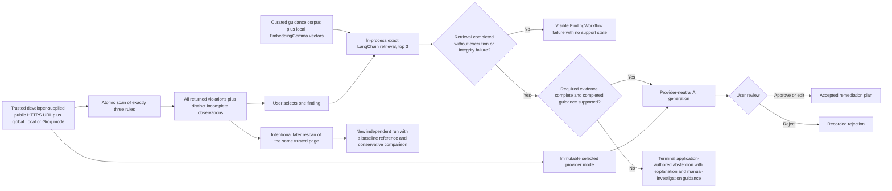

# Project concept

## Working name

A11y Evidence Lab.

## Status

**Document status:** Product-intent and planning-context summary, reviewed on 2026-09-01 (UTC). This document is not acceptance authority; individual directions are Accepted, Proposed, Deferred, or Superseded only where the canonical requirements baseline or an ADR records that status.

**Repository stage:** Development ready through OD-025, with current MVP scope narrowed by OD-026 and OD-027 on 2026-09-01. Implementation follows the derived [development roadmap](DEVELOPMENT_ROADMAP.md). RD-002, RD-003, and M1-01 through M1-04 are Complete. M1-05 is Complete again after the two post-closure corrections passed 335 tests, strict TypeScript, fresh independent reviews, exact cleanup, and renewed documentation closure. The earlier public-page smoke remains historical evidence and was not repeated. Retrieval and provider calls remain unimplemented.

[M1-02](plans/completed/m1-02-local-service-and-aggregate.md) is Complete after verified storage/service implementation and documentation closure. [M1-03 — Real scan and evidence](plans/completed/m1-03-real-scan-and-evidence.md) is Complete after owner-authorized execution and verified closure. Both scanner slices and their S3 reviews are accepted. All 290 integrated tests and independent strict typechecking pass, including the failed-launch residue regression. The different final integrated critical review, exact task-owned runtime cleanup and documentation closure passed. At M1-03 closure, M1-04 and M1-05 were unselected.

[M1-04 — Target and results UI](plans/completed/m1-04-target-and-results-ui.md) is Complete after the accepted [Analyze and results presentation](ui/ANALYZE_AND_RESULTS_PRESENTATION.md), renewed verification, and closure. Its accepted OD-026 boundary and canonical data remain unchanged. M1-05 is Complete again after the two post-closure corrections passed 335 tests, strict TypeScript, fresh independent reviews, exact cleanup, and renewed documentation closure. The earlier public-page smoke remains historical evidence and was not repeated. Retrieval and provider calls remain unimplemented.

## Concept

Build a web accessibility evidence explorer for engineering teams. The product would combine deterministic browser analysis with an AI workflow that retrieves relevant accessibility guidance, explains findings with citations, proposes remediation, presents proposals for user review when judgment is required, and compares results after a page is changed.

The interface should be an evidence-oriented application rather than a generic chatbot.

## Basic implementation flow

## Possible user flow

1. To use retrieval in either generation mode, the developer first installs Ollama and pulls `embeddinggemma` with Ollama's own tools outside A11y Evidence Lab. Local generation additionally requires `qwen3.5:4b`; Groq generation instead requires a Groq credential in the local service. The application has no runtime installer, model downloader, acquisition-progress view, model manager, or provider-probe screen. The developer then starts the local application service and opens its loopback address in Chrome or Edge. There is no MVP installer, desktop wrapper, Start menu shortcut, or application-controlled webview.
2. Before analysis, the user enters one non-authenticated public HTTPS URL that they are responsible for choosing and are permitted to analyze, and explicitly selects one global generation mode: the configured local model or Groq. The URL is trusted developer input; the application does not independently prove public reachability, ownership, or safety. The ready Analyze form shows no normal mode explanation, while the selected provider and exact model remain immutable internal run context and become visible when later provider use is relevant. Selecting a mode invokes or probes nothing.
3. The user activates **Analyze** once. The local service first performs basic URL parsing. If the input is accepted, it creates the PageAnalysisRun, opens the page in a fresh non-persistent browser context without imported profile or cookie state, and runs one atomic scan containing exactly `image-alt`, `label`, and `color-contrast` against the entire top-level document in its current rendered state at the configured readiness condition, with iframe documents excluded. It does not discover or follow links, submit forms, interact with controls, upload files, or permit downloads. A simple timeout and cleanup path apply.
4. The application lists every axe violation node returned by the three-rule scan as an independent finding. Native `incomplete` observations remain visible and separate. Zero findings is valid only after complete three-rule coverage. A navigation, scanner, or timeout failure; a fatal top-level result-validation or evidence-capture failure that prevents the complete bounded result; or failure to persist the initial complete aggregate remains visible and cannot produce a complete or silently truncated result. A missing, invalid, or withheld individual allowlisted fact instead remains attached to its finding or observation with a concise category or sufficiency reason.
5. The user selects one finding. A retrieval pipeline uses only that finding's minimized evidence and the fixed corpus. On the first explicit retrieval request, the local adapter checks for Ollama and `embeddinggemma`, performs the actual embedding work, and builds the disposable in-memory vector collection once for that process; application startup performs neither a readiness probe nor embedding work. LangChain's in-process `MemoryVectorStore` applies the accepted broad rule/success-criterion filter, exact cosine ranking, and fixed top three. Other findings remain independent and are not combined into the query or proposal, and no Chroma or other vector-database service is involved.
6. The application keeps the selected Finding visible and deterministically checks whether its required evidence is complete and a completed retrieval is `supported`. Incomplete required evidence or a completed `incomplete`, `missing`, or `conflicting` retrieval ends the FindingWorkflow in an application-authored abstention that clearly explains the blocking sufficiency state and missing or conflicting information, confirms that no model was called, and provides manual-investigation guidance. A retrieval execution or passage-integrity failure instead fails the FindingWorkflow with no support state, abstention, or provider call. An abstention has no proposal-review decision. If eligible, the user explicitly starts generation. The selected adapter performs only its attempt-time prerequisite check, makes the one actual request, and validates the returned structured value against the application-owned contract. A valid response supplies one explanation, remediation proposal, citations, confidence/uncertainty, one blocking pre-acceptance judgment, and one non-blocking post-change verification reminder. Provider provenance is recorded only for an attempted call. A missing prerequisite, request error, or invalid response remains visible and never triggers automatic fallback, provider mixing, a synthetic probe, or bulk retry.
7. For a validated proposal only, the application presents its evidence, citations, evidence sufficiency, pre-acceptance judgment, and post-change reminder so the user can approve, edit, or reject it independently. The judgment gates acceptance; the reminder does not. It creates no aggregate page proposal or decision.
8. From any retained baseline Finding, a later analysis of the same developer-selected page compares correlated scan evidence conservatively without requiring prior retrieval, generation, abstention, or review. Ambiguous target identity or changed page structure yields `inconclusive` or `not comparable`; no comparison outcome proves whole-page accessibility.

As the workflow progresses, the local service updates one canonical versioned `data/runs/<run-id>/run.json` aggregate containing the complete scan and current nested per-finding data. It creates no canonical child files, independently versioned workflow records, Markdown report, database, or audit graph.

The MVP accepts one page target but performs no target discovery, link following as scan targets, crawling, authentication, multi-page intake, broader-rule scan, or bulk generation. The fixed synthetic profiles remain deterministic evaluation inputs.

## Engineering objective

The project objective is to demonstrate the practical use of RAG and LangChain as a complete, evidence-centered portfolio workflow rather than a basic question-answering demonstration:

- RAG grounded in a curated and versioned corpus.
- LangChain for bounded in-process exact-vector retrieval and the retrieve-then-generate-or-abstain integration; the fixed corpus does not justify a Chroma service.
- Plain TypeScript state for the first linear workflow and one selected proposal's review decision at a time.
- LangGraph only if a later demonstrated recovery or resume requirement needs it.
- One content-safe versioned `run.json` aggregate per analysis plus local diagnostics and a compact fixed evaluation manifest; there is no Markdown report, and LangSmith is deferred outside the MVP.
- Measurable retrieval and answer quality instead of relying only on a polished demo.
- Human-in-the-loop decisions and explicit abstention when the evidence is insufficient.
- Conventional engineering quality around the AI workflow.
- A replaceable structured-generation provider so developer-managed local `qwen3.5:4b` and Groq model ID `openai/gpt-oss-20b`, the two fixed MVP evaluation configurations, can execute the same application-owned contract without changing evidence, validation, or review semantics.

The provider boundary, global immutable Local/Groq analysis choice, no-fallback behavior, local-service/browser startup, and no-installer MVP boundary are accepted directions. [OD-021](requirements/DELIVERY_READINESS_AND_OPEN_DECISIONS.md#od-021--trusted-operator-url-boundary-for-the-portfolio-mvp) retains OD-020's public-page, exact-three-rule, variable-finding interaction while replacing its production hostile-target controls with the trusted developer-input portfolio assumption. [ADR-0018](architecture/decisions/ADR-0018-trusted-operator-url-boundary.md) accepts that proportional boundary. [OD-022](requirements/DELIVERY_READINESS_AND_OPEN_DECISIONS.md#od-022--portfolio-mvp-yagni-simplification), [OD-027](requirements/DELIVERY_READINESS_AND_OPEN_DECISIONS.md#od-027--simplify-analysis-and-results-presentation), [ADR-0019](architecture/decisions/ADR-0019-in-process-exact-vector-search.md), [ADR-0020](architecture/decisions/ADR-0020-manual-developer-managed-local-model-setup.md), and [ADR-0021](architecture/decisions/ADR-0021-single-file-run-aggregate.md) accept the in-process retrieval, developer-managed setup, actual-call validation, provider-relevant disclosure, single-aggregate persistence, and evidence-first Analyze/Results presentation boundaries. [ADR-0022](architecture/decisions/ADR-0022-closed-versioned-guidance-corpus.md) accepts the closed manually segmented corpus. [ADR-0023](architecture/decisions/ADR-0023-local-mode-data-boundary.md) accepts loopback-only Local-generation data flow and local embedding computation without claiming an offline or machine-wide zero-egress workflow. ADR-0007 and ADR-0016 remain visible as superseded decision history. The bounded LangChain role is Accepted for evaluation only and remains one selected finding at a time. TypeScript is the initial application-language evaluation baseline, and React is the initial client-interface evaluation baseline. React remains presentation-only over the application-owned local API; durable workflow state and privileged operations remain outside browser-delivered code. These and the other initial technology baselines are recorded in the [architecture decisions](architecture/decisions/README.md). None is thereby promoted to an implemented or release-qualified dependency. Desktop packaging, installer work, application-managed model acquisition, hostile-page isolation, connection-level egress control, and exhaustive resource-limit qualification are deferred. Exact package versions, model digests, runtime parameters, and capacity measurements remain implementation-stage evaluation details.

## Intended boundaries

- It would not certify that a website is accessible or legally compliant.
- It would not automatically modify a user's code.
- It would accept one developer-entered non-authenticated public HTTPS page per analysis as trusted input. The developer would own authorization; the MVP would not claim to detect hostile, private, or redirect-based targets safely.
- It would scan only `image-alt`, `label`, and `color-contrast`, list every returned violation node, and never present a failed, partial, or truncated scan as complete.
- It would not discover targets, crawl links, scan multiple pages, broaden the rule set, combine findings into one prompt, or bulk-generate remediation proposals.
- It would not expose private pages, source code, or sensitive traces in a public demo.
- It would not add accounts, roles, permissions, assignments, team workflows, or collaboration features to the single-user MVP.
- Chat, if included, would be secondary to the evidence and review workflow.

## Fixed before first-slice evaluation

- The primary user is a frontend developer; QA is the secondary user. These labels do not create product accounts or roles.
- The three scenario identities each have one logical failing state and one logical corrected state. Before evaluation, their content, expected rule result, stable target key, fixture revision, browser profile, and rule profile are frozen in one compact, non-promotable manifest.
- These scenarios remain the reproducible evaluation baseline and are not user-submitted runtime targets. Evaluation success does not qualify public-page isolation, arbitrary live content, or broader accessibility coverage.
- The closed eight-artifact W3C guidance pack and its manual deterministic passage boundary are accepted in ADR-0022. Its source URLs, attribution, copyright and status notices, and snapshot or version identifiers are recorded before derived retrieval content is evaluated. Planning does not download or copy that content.
- The evaluation manifest contains one happy-path local generation case and one happy-path Groq generation case for each scenario. Shared deterministic abstention and comparison checks are not duplicated merely to create a larger sample.

## Deferred implementation and distribution questions

- Which exact `qwen3.5:4b` and `embeddinggemma` digests, runtime parameters, and capacity observations should be frozen after the reference-PC gate is measured?
- [RD-002](plans/completed/rd-002-minimum-development-toolchain-literals.md#accepted-synthesis-and-ordinary-literal-freeze) selects the minimum M1 package versions and local-service host. [RD-003](plans/completed/rd-003-scan-evaluation-boundary.md#accepted-setup-and-native-observations--rd003-observations-001) supplies the frozen scan-only profile and six native fixture observations; application and public-page behavior remain later-task work, with no release qualification.
- Whether production use ever justifies hostile-target isolation, connection-level destination controls, exhaustive resource ceilings, and below/exact/over-limit qualification remains deferred until a demonstrated product need.
- Whether a desktop container, installer, formal support matrix, hosted tracing, or release-qualification process is ever needed remains deferred until demonstrated product or distribution need.

## Documentation navigation

- Previous: [Project context](PROJECT_CONTEXT.md)
- [Documentation index](README.md)
- Next: [Project requirements](PROJECT_REQUIREMENTS.md)
