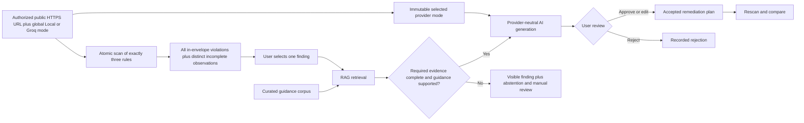

# Project concept

## Working name

A11y Evidence Lab.

## Status

Idea only, recorded on 2026-08-20. No implementation has started.

## Concept

Build a web accessibility evidence explorer for engineering teams. The product would combine deterministic browser analysis with an AI workflow that retrieves relevant accessibility guidance, explains findings with citations, proposes remediation, presents proposals for user review when judgment is required, and compares results after a page is changed.

The interface should be an evidence-oriented application rather than a generic chatbot.

## Basic implementation flow

## Possible user flow

1. The frontend developer starts the local application service on the developer machine and opens its loopback address in Chrome or Edge. There is no MVP installer, desktop wrapper, Start menu shortcut, or application-controlled webview.
2. Before analysis, the user enters one public HTTPS URL, explicitly attests that the page is authorized for analysis, and selects one global generation mode: the configured local model or Groq. The mode is immutable for the analysis, selecting it does not invoke a model, and readiness is checked only before an eligible finding-specific invocation.
3. The user activates **Analyze** once. The local service creates the PageAnalysisRun, validates the public target and redirects under [ADR-0017](architecture/decisions/ADR-0017-authorized-public-page-scan-boundary.md), opens it in a fresh ephemeral browser context, and runs one atomic scan containing exactly `image-alt`, `label`, and `color-contrast`.
4. The application lists every axe violation node returned within the accepted scan envelope as an independent finding. Native `incomplete` observations remain visible and separate. Zero findings is valid only after complete three-rule coverage; a resource or policy overflow fails the operation visibly with its coverage limitation and without silent truncation.
5. The user selects one finding. A retrieval pipeline uses only that finding's minimized evidence to find the most relevant approved WCAG and implementation guidance. Other findings remain independent and are not combined into the query or proposal.
6. The application keeps the selected finding visible and deterministically checks whether its required evidence is complete and retrieved guidance is `supported`. If not, it records abstention and manual review without calling a model. If eligible, the globally selected provider produces one structured explanation, remediation proposal, citations, confidence/uncertainty, and required manual checks through the application-owned contract. Provider provenance is recorded only for the invocation that occurred. A failure is reported and never triggers automatic fallback, provider mixing, or bulk retry.
7. The application presents that proposal with its evidence, citations, evidence sufficiency, and manual checks so the user can approve, edit, or reject it independently. It creates no aggregate page proposal or decision.
8. A later analysis of the same authorized page compares correlated finding evidence conservatively. Ambiguous target identity or changed page structure yields `inconclusive` or `not comparable`; no comparison outcome proves whole-page accessibility.

The MVP accepts one page target but performs no target discovery, link following as scan targets, crawling, authentication, multi-page intake, broader-rule scan, or bulk generation. The fixed synthetic profiles remain deterministic evaluation inputs.

## Engineering objective

The project objective is to demonstrate the practical use of RAG and LangChain as a complete, evidence-centered portfolio workflow rather than a basic question-answering demonstration:

- RAG grounded in a curated and versioned corpus.
- LangChain for the bounded retrieve-then-generate-or-abstain integration.
- Plain TypeScript state for the first linear workflow and one selected finding's review decision at a time.
- LangGraph only if a later demonstrated recovery or resume requirement needs it.
- Content-safe local records and diagnostics plus a compact fixed evaluation manifest; LangSmith is deferred outside the MVP.
- Measurable retrieval and answer quality instead of relying only on a polished demo.
- Human-in-the-loop decisions and explicit abstention when the evidence is insufficient.
- Conventional engineering quality around the AI workflow.
- A replaceable structured-generation provider so the downloaded local configuration and Groq model ID `openai/gpt-oss-20b`, the fixed MVP API evaluation configuration, can execute the same application-owned contract without changing evidence, validation, or review semantics.

The provider boundary, global immutable Local/Groq analysis choice, no-fallback behavior, local-service/browser startup, and no-installer MVP boundary are accepted directions. [OD-020](requirements/DELIVERY_READINESS_AND_OPEN_DECISIONS.md#od-020--authorized-public-page-analysis-scope) accepts the public-page, exact-three-rule, variable-finding interaction and retains OD-019's controlled profiles as the evaluation baseline. [ADR-0017](architecture/decisions/ADR-0017-authorized-public-page-scan-boundary.md) accepts the mandatory public-target trust boundary. The bounded LangChain role is Accepted for evaluation only and remains one selected finding at a time. TypeScript is the initial application-language evaluation baseline, and React is the initial client-interface evaluation baseline. React remains presentation-only over the application-owned local API; durable workflow state and privileged operations remain outside browser-delivered code. These and the other initial technology baselines are recorded in the [architecture decisions](architecture/decisions/README.md). None is thereby promoted to a release-qualified dependency. Desktop packaging and installer work are deferred. Exact numeric scan limits remain open pre-development planning decisions, while package versions and the capacity-screened local model configuration remain evaluation details.

## Intended boundaries

- It would not certify that a website is accessible or legally compliant.
- It would not automatically modify a user's code.
- It would accept only one user-attested, policy-valid public HTTPS page per analysis and would reject authentication, non-public destinations, disallowed redirects, and targets outside the accepted network policy.
- It would scan only `image-alt`, `label`, and `color-contrast`, list every in-envelope violation node, and never present a partial or truncated scan as complete.
- It would not discover targets, crawl links, scan multiple pages, broaden the rule set, combine findings into one prompt, or bulk-generate remediation proposals.
- It would not expose private pages, source code, or sensitive traces in a public demo.
- It would not add accounts, roles, permissions, assignments, team workflows, or collaboration features to the single-user MVP.
- Chat, if included, would be secondary to the evidence and review workflow.

## Fixed before first-slice evaluation

- The primary user is a frontend developer; QA is the secondary user. These labels do not create product accounts or roles.
- The three scenario identities each have one logical failing state and one logical corrected state. Before evaluation, their content, expected rule result, stable target key, fixture revision, browser profile, and rule profile are frozen in one compact, non-promotable manifest.
- These scenarios remain the reproducible evaluation baseline and are not user-submitted runtime targets. Evaluation success does not qualify public-page isolation, arbitrary live content, or broader accessibility coverage.
- The bounded W3C guidance pack records approved source URLs, attribution, copyright and status notices, and snapshot or version identifiers before derived retrieval content is evaluated. Planning does not download or copy that content.
- The evaluation manifest contains one happy-path local generation case and one happy-path Groq generation case for each scenario. Shared deterministic abstention and comparison checks are not duplicated merely to create a larger sample.

## Deferred implementation and distribution questions

- Which capacity-screened local model configuration should be used for the controlled portfolio evaluation after the reference-PC gate is measured?
- Which exact package versions and local-service host satisfy the accepted browser-local boundary without promoting evaluation candidates to release dependencies?
- What exact numeric limits should implement the already accepted page-load, redirect, resource, duration, DOM, result-count, and evidence-size boundaries? Any exceeded bound must remain fail-visible; the values are still open and may not be inferred from this concept document.
- Whether a desktop container, installer, formal support matrix, hosted tracing, or release-qualification process is ever needed remains deferred until demonstrated product or distribution need.

## Documentation navigation

- Previous: [Project context](PROJECT_CONTEXT.md)
- [Documentation index](README.md)
- Next: [Project requirements](PROJECT_REQUIREMENTS.md)
