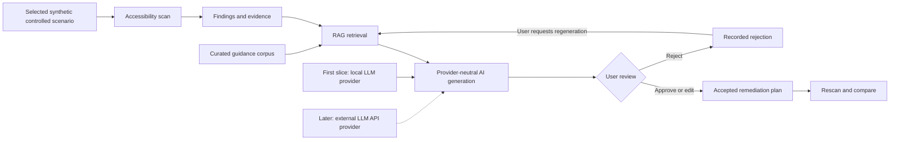

# Project concept

## Working name

A11y Evidence Lab.

## Status

Idea only, recorded on 2026-08-20. No implementation has started.

## Concept

Build a web accessibility evidence explorer for engineering teams. The product would combine deterministic browser analysis with an AI workflow that retrieves relevant accessibility guidance, explains findings with citations, proposes remediation, presents proposals for user review when judgment is required, and compares results after a page is changed.

The interface should be an evidence-oriented application rather than a generic chatbot.

## Basic implementation flow

## Possible user flow

1. In a later distributable build, the user starts the installed Windows application from its shortcut; the local launcher opens the web interface in an application-controlled window or isolated browser context. On first launch, the user may configure the release-qualified local LLM profile, configure an external LLM API, or defer AI setup. Installer completion is not required to demonstrate the first portfolio slice.
2. The user selects one project-owned failing or corrected fixture revision from exactly three profiles: `informative-image-alt` (`image-alt` / SC 1.1.1), `form-input-label` (`label` / SC 4.1.2), or `text-contrast` (`color-contrast` / SC 1.4.3), then confirms its bounded fixture attestation.
3. The system runs only the selected profile's deterministic rule and collects its minimized finding evidence or required same-target positive observation.
4. A retrieval pipeline finds the most relevant approved WCAG and implementation guidance for that profile.
5. The selected generation provider produces a structured explanation, remediation proposal, citations, evidence-sufficiency indicator, and required manual checks through the same application-owned contract.
6. The application presents the proposal with its evidence, citations, evidence sufficiency, and manual checks so the user can approve, edit, or reject it.
7. A later scan compares finding evidence for the same selected profile. `image-alt` and `label` use binary `resolved`, `persistent`, or inverse-pair `regressed` semantics. `color-contrast` also uses its retained ordered contrast margin to distinguish a native-pass `resolved` result from a strictly higher but still-failing `improved` result.

The MVP has no live-site input, arbitrary-URL input, crawling, or crawler implementation. That boundary is deliberate: the portfolio demonstrates the complete technology integration, while production target discovery and broader rule coverage remain later responses to demonstrated product need.

## Engineering objective

The project objective is to demonstrate the practical use of RAG and LangChain as a complete, evidence-centered portfolio workflow rather than a basic question-answering demonstration:

- RAG grounded in a curated and versioned corpus.
- LangChain for the bounded retrieve-then-generate integration.
- Plain TypeScript state for the first linear workflow and single review decision.
- LangGraph only if a later demonstrated recovery or resume requirement needs it.
- Local traces and a small fixed evaluation set first; LangSmith remains an optional synthetic-data evaluation candidate.
- Measurable retrieval and answer quality instead of relying only on a polished demo.
- Human-in-the-loop decisions and explicit abstention when the evidence is insufficient.
- Conventional engineering quality around the AI workflow.
- A replaceable structured-generation provider so the first local configuration, and a later external-API configuration, can be evaluated without changing evidence, validation, or review semantics.

The provider boundary, later explicit local/API choice, and Windows installation direction are accepted directions. Separately, OD-019 accepts exactly the three controlled portfolio profiles and supersedes the earlier one-`image-alt` scope in the [product decision register](requirements/DELIVERY_READINESS_AND_OPEN_DECISIONS.md#resolved-decisions-for-the-first-portfolio-slice). The bounded LangChain role is Accepted for evaluation only. TypeScript is the initial application-language evaluation baseline, and React is the initial client-interface evaluation baseline. React remains presentation-only over the application-owned local API; durable workflow state and privileged operations remain outside browser-delivered code. These and the other initial technology baselines are recorded in the [architecture decisions](architecture/decisions/README.md), while the exact release model, external API adapter, release vector store, JavaScript runtime, desktop container, runtime ownership, and packaging technology remain open to evaluation. The scenario decision does not promote any of those candidates to a release dependency.

## Intended boundaries

- It would not certify that a website is accessible or legally compliant.
- It would not automatically modify a user's code.
- The portfolio MVP would not accept live sites or arbitrary URLs and would contain no crawling or crawler implementation; those remain possible later capabilities only after demonstrated need and separate safety decisions.
- It would not expose private pages, source code, or sensitive traces in a public demo.
- Chat, if included, would be secondary to the evidence and review workflow.

## Questions to resolve before first-slice development

- Who is the first target user: frontend developers, QA engineers, or accessibility specialists?
- Which exact W3C source snapshots and usage terms should be approved for the proposed eight-artifact corpus covering SC 1.1.1, SC 4.1.2, and SC 1.4.3?
- What exact cases inside the proposed bounded 9–12-case synthetic suite, one-reviewer rubric, and non-promotable success criteria will evaluate all three profiles?

## Questions to resolve before later distributable stages

- Which capacity-qualified local model configuration should become the release default, and which external API adapter should be supported first?
- Which JavaScript runtime, local-service host, desktop container, Windows packaging technology, and runtime-ownership model satisfy installation, update, signing, offline, isolation, and zero-egress requirements?
- What expanded evaluation evidence and thresholds would justify provider, performance, support, or release claims?

## Documentation navigation

- Previous: [Project context](PROJECT_CONTEXT.md)
- [Documentation index](README.md)
- Next: [Project requirements](PROJECT_REQUIREMENTS.md)
