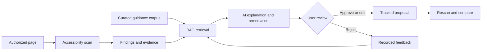

# Project concept

## Working name

A11y Evidence Lab.

## Status

Idea only, recorded on 2026-08-20. No implementation has started.

## Concept

Build a web accessibility evidence explorer for engineering teams. The product would combine deterministic browser analysis with an AI workflow that retrieves relevant accessibility guidance, explains findings with citations, proposes remediation, presents proposals for user review when judgment is required, and compares results after a page is changed.

The interface should be an evidence-oriented application rather than a generic chatbot.

## Basic implementation flow

## Possible user flow

1. A user selects an authorized page or controlled fixture.
2. The system collects deterministic accessibility findings and page evidence.
3. A retrieval pipeline finds the most relevant WCAG and implementation guidance.
4. The AI produces a structured explanation, remediation proposal, citations, confidence, and required manual checks.
5. The application presents the proposal with its evidence, citations, confidence, and manual checks so the user can approve, edit, or reject it.
6. A later scan compares the evidence and shows whether the issue improved, remained, or regressed.

## Engineering objective

The project objective is to demonstrate the practical use of RAG, LangChain, LangGraph, and LangSmith as a complete, evidence-centered AI workflow rather than a basic question-answering demonstration:

- RAG grounded in a curated and versioned corpus.
- LangChain for retrieval and model integration.
- LangGraph for a stateful workflow with review and recovery steps.
- LangSmith for traces, datasets, evaluation, and regression analysis.
- Measurable retrieval and answer quality instead of relying only on a polished demo.
- Human-in-the-loop decisions and explicit abstention when the evidence is insufficient.
- Conventional engineering quality around the AI workflow.

The exact models, vector store, integration design, and deployment path remain open to evaluation.

## Intended boundaries

- It would not certify that a website is accessible or legally compliant.
- It would not automatically modify a user's code.
- It would not crawl arbitrary websites without authorization.
- It would not expose private pages, source code, or sensitive traces in a public demo.
- Chat, if included, would be secondary to the evidence and review workflow.

## Questions to resolve before development

- Who is the first target user: frontend developers, QA engineers, or accessibility specialists?
- Which small set of accessibility scenarios should the first version cover deeply?
- Which sources belong in the initial retrieval corpus?
- Which model and vector store should run locally, and what hosted alternative should exist?
- What evaluation dataset and success thresholds would make the claims credible?
- What is the smallest end-to-end demo that still shows the complete workflow?

## Documentation navigation

- Previous: [Project context](PROJECT_CONTEXT.md)
- [Documentation index](README.md)
- Next: [Local MVP feasibility](LOCAL_MVP_FEASIBILITY.md)
