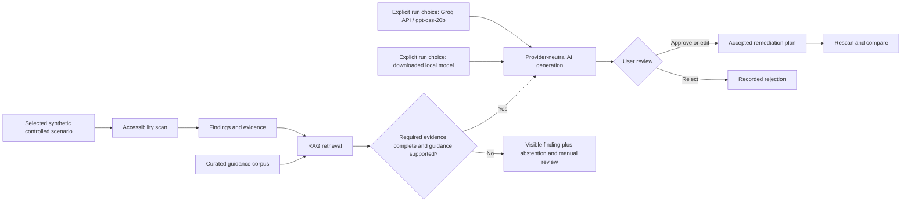

# Project concept

## Working name

A11y Evidence Lab.

## Status

Idea only, recorded on 2026-08-20. No implementation has started.

## Concept

Build a web accessibility evidence explorer for engineering teams. The product would combine deterministic browser analysis with an AI workflow that retrieves relevant accessibility guidance, explains findings with citations, proposes remediation, presents proposals for user review when judgment is required, and compares results after a page is changed.

The interface should be an evidence-oriented application rather than a generic chatbot.

## Basic implementation flow

## Possible user flow

1. The frontend developer starts the local application service on the developer machine and opens its loopback address in Chrome or Edge. There is no MVP installer, desktop wrapper, Start menu shortcut, or application-controlled webview.
2. The user selects one project-owned failing or corrected fixture revision from exactly three profiles: `informative-image-alt` (`image-alt` / SC 1.1.1), `form-input-label` (`label` / SC 4.1.2), or `text-contrast` (`color-contrast` / SC 1.4.3), then confirms its bounded fixture attestation.
3. The system runs only the selected profile's deterministic rule and collects its minimized finding evidence or required same-target positive observation.
4. A retrieval pipeline finds the most relevant approved WCAG and implementation guidance for that profile.
5. The application keeps the finding visible and deterministically checks whether the required evidence is complete and retrieved guidance is `supported`. If not, it records abstention and manual review without calling a model. If eligible, the user explicitly selects either a separately downloaded local model or the Groq API, and that provider produces a structured explanation, remediation proposal, citations, confidence/uncertainty, and required manual checks through the same application-owned contract. A provider failure is reported and never triggers automatic fallback to the other mode.
6. The application presents the proposal with its evidence, citations, evidence sufficiency, and manual checks so the user can approve, edit, or reject it.
7. A later scan compares finding evidence for the same selected profile. `image-alt` and `label` use binary `resolved`, `persistent`, or inverse-pair `regressed` semantics. `color-contrast` also uses its retained ordered contrast margin to distinguish a native-pass `resolved` result from a strictly higher but still-failing `improved` result.

The MVP has no live-site input, arbitrary-URL input, crawling, or crawler implementation. That boundary is deliberate: the portfolio demonstrates the complete technology integration, while production target discovery and broader rule coverage remain later responses to demonstrated product need.

## Engineering objective

The project objective is to demonstrate the practical use of RAG and LangChain as a complete, evidence-centered portfolio workflow rather than a basic question-answering demonstration:

- RAG grounded in a curated and versioned corpus.
- LangChain for the bounded retrieve-then-generate-or-abstain integration.
- Plain TypeScript state for the first linear workflow and single review decision.
- LangGraph only if a later demonstrated recovery or resume requirement needs it.
- Content-safe local records and diagnostics plus a compact fixed evaluation manifest; LangSmith is deferred outside the MVP.
- Measurable retrieval and answer quality instead of relying only on a polished demo.
- Human-in-the-loop decisions and explicit abstention when the evidence is insufficient.
- Conventional engineering quality around the AI workflow.
- A replaceable structured-generation provider so the downloaded local configuration and Groq model ID `openai/gpt-oss-20b`, the fixed MVP API evaluation configuration, can execute the same application-owned contract without changing evidence, validation, or review semantics.

The provider boundary, per-run choice between local and Groq generation, no-fallback behavior, local-service/browser startup, and no-installer MVP boundary are accepted directions. Separately, OD-019 accepts exactly the three controlled portfolio profiles and supersedes the earlier one-`image-alt` scope in the [product decision register](requirements/DELIVERY_READINESS_AND_OPEN_DECISIONS.md#resolved-decisions-for-the-first-portfolio-slice). The bounded LangChain role is Accepted for evaluation only. TypeScript is the initial application-language evaluation baseline, and React is the initial client-interface evaluation baseline. React remains presentation-only over the application-owned local API; durable workflow state and privileged operations remain outside browser-delivered code. These and the other initial technology baselines are recorded in the [architecture decisions](architecture/decisions/README.md). None is thereby promoted to a release-qualified dependency. Desktop packaging and installer work are deferred, while the exact package versions and capacity-screened local model configuration remain implementation-time evaluation details.

## Intended boundaries

- It would not certify that a website is accessible or legally compliant.
- It would not automatically modify a user's code.
- The portfolio MVP would not accept live sites or arbitrary URLs and would contain no crawling or crawler implementation; those remain possible later capabilities only after demonstrated need and separate safety decisions.
- It would not expose private pages, source code, or sensitive traces in a public demo.
- It would not add accounts, roles, permissions, assignments, team workflows, or collaboration features to the single-user MVP.
- Chat, if included, would be secondary to the evidence and review workflow.

## Fixed before first-slice evaluation

- The primary user is a frontend developer; QA is the secondary user. These labels do not create product accounts or roles.
- The three scenario identities each have one logical failing state and one logical corrected state. Before evaluation, their content, expected rule result, stable target key, fixture revision, browser profile, and rule profile are frozen in one compact, non-promotable manifest.
- The bounded W3C guidance pack records approved source URLs, attribution, copyright and status notices, and snapshot or version identifiers before derived retrieval content is evaluated. Planning does not download or copy that content.
- The evaluation manifest contains one happy-path local generation case and one happy-path Groq generation case for each scenario. Shared deterministic abstention and comparison checks are not duplicated merely to create a larger sample.

## Deferred implementation and distribution questions

- Which capacity-screened local model configuration should be used for the controlled portfolio evaluation after the reference-PC gate is measured?
- Which exact package versions and local-service host satisfy the accepted browser-local boundary without promoting evaluation candidates to release dependencies?
- Whether a desktop container, installer, formal support matrix, hosted tracing, or release-qualification process is ever needed remains deferred until demonstrated product or distribution need.

## Documentation navigation

- Previous: [Project context](PROJECT_CONTEXT.md)
- [Documentation index](README.md)
- Next: [Project requirements](PROJECT_REQUIREMENTS.md)
