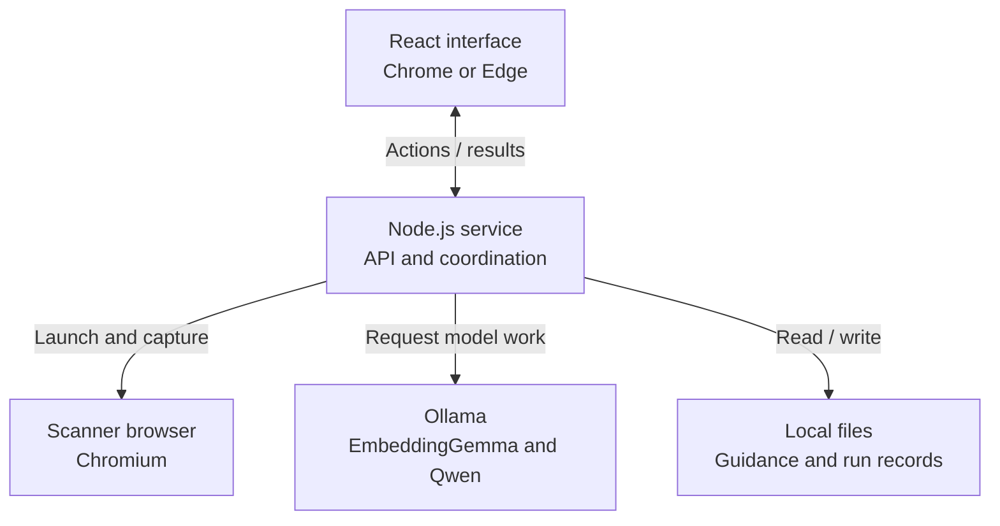
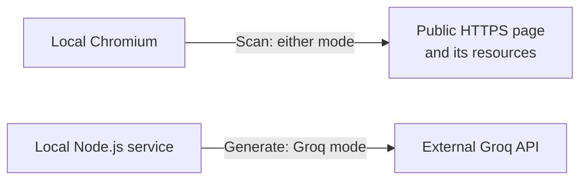
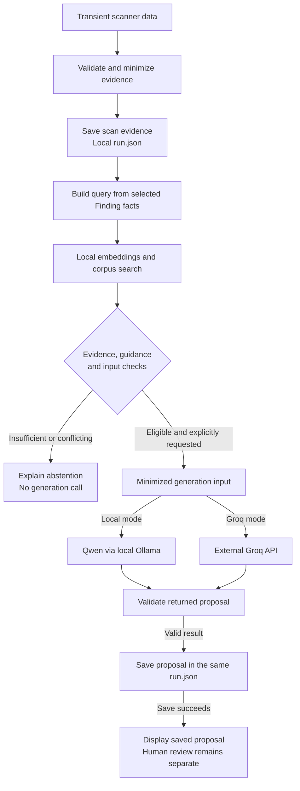

# Implemented system architecture

[Project overview](../../README.md) · [Architecture index](README.md) · [Application walkthrough](../APPLICATION_GUIDE.md#walkthrough-a-form-field-without-a-label)

This guide describes how the implemented portfolio MVP fits together. A **Finding** is one recorded accessibility issue. The linked source files show the responsibilities; [architecture decision records (ADRs)](decisions/README.md) explain the accepted decisions. This guide adds no new design or product requirement. The [bounded evidence report](../BOUNDED_MVP_EVIDENCE.md) records verification and known limitations.

## Main components

The app has a React interface in Chrome or Edge and one Node.js service on the developer's computer. The service serves the built interface and its HTTP API on `127.0.0.1`. It coordinates one operation at a time and owns access to files, the scanner and model providers.

### Local components

Every component in this diagram runs or is stored on the developer's computer. The fixed guidance collection is called the **corpus**. **Embeddings** are numerical representations of text used to rank guidance passages by similarity.

**Reading the arrows:** the two-way link shows interface actions and service replies. Every one-way arrow points from the caller to the process, service or files it accesses; replies are implicit. The fixed corpus is read-only; run records are read and updated.

The table below details responsibilities inside the single Node.js service. Ollama and the scanner browser are separate local processes. Model responses return to their calling adapters; those adapters validate them before the service publishes results. Embeddings stay local in both modes. Choosing Local or Groq changes the generation provider, not scanning or guidance search.

### External connections

These are the same local scanner and Node.js service shown above. Each row shows one connection from the computer to an external destination; it is not a sequence of workflow steps.

Scanning contacts the trusted public page and its resources in either mode. Groq generation sends only the permitted input for the selected issue to the external API. Local generation stays with Ollama. Citation links and setup downloads can also use the network, as explained under [data flow and boundaries](#data-flow-and-boundaries).

## Who owns each responsibility

| Component | Responsibility and source entry points |
| --- | --- |
| Browser interface | [App.tsx](../../src/client/App.tsx) composes the interaction. [Components](../../src/client/components) display findings, guidance, proposals, human decisions and comparisons. Client admission code checks replies before showing success. The interface does not read local files or hold provider credentials. |
| Startup and local service | [main.ts](../../src/server/main.ts) selects the run and built-client directories. [service.ts](../../src/server/service.ts) owns operation admission, coordination and shutdown; [loopback-api.ts](../../src/server/local-service/loopback-api.ts) routes HTTP requests. |
| Scanner | [scan-page.ts](../../src/server/scan/scan-page.ts) manages Chromium. [native-scan-capture.ts](../../src/server/scan/native-scan-capture.ts) runs the three axe-core rules; [normalize-scan.ts](../../src/server/scan/normalize-scan.ts) converts results into allowed evidence. Incomplete observations stay separate from Findings. |
| Guidance search | [exact-retrieval.ts](../../src/server/retrieval/exact-retrieval.ts) loads the fixed corpus and calls local embeddings. [retrieval-ranking.ts](../../src/server/retrieval/retrieval-ranking.ts) uses LangChain MemoryVectorStore for exact cosine search, selecting at most one passage per required guidance role. The vector collection is created lazily and lives only in process memory. |
| Generation | [generation-operation.ts](../../src/server/local-service/generation-operation.ts) continues an eligible Finding workflow. The [shared stage](../../src/server/generation/generation-stage.ts) checks input and output; the [adapter resolver](../../src/server/local-service/generation-adapters.ts) selects native-schema Local Qwen or the fixed Groq adapter. |
| Human review | [review-operation.ts](../../src/server/local-service/review-operation.ts) and [review-contract.ts](../../src/server/domain/review-contract.ts) validate one final human decision. Approval or edit-and-accept requires support confirmation and a suitable blocking judgment. The original AI proposal is preserved. |
| Comparison | [rescan-comparison.ts](../../src/server/local-service/rescan-comparison.ts) connects the later scan to the pure [comparison policy](../../src/server/comparison/compare-finding.ts). [comparison-publication.ts](../../src/server/local-service/comparison-publication.ts) saves the comparison without replacing the baseline. This path needs no prior generation or review. |
| Records and validation | [run-contract.ts](../../src/server/domain/run-contract.ts) exposes the aggregate's runtime validator. [run-repository.ts](../../src/server/persistence/run-repository.ts) validates reads and writes, checks allowed transitions and publishes one complete record. Updates preserve earlier scan evidence and other Findings. |

The service calls these owners; the browser sends explicit actions rather than coordinating provider or filesystem work itself. Pure domain and comparison functions operate on supplied values, while scanner, provider and repository modules handle external effects. The [repository map](../DEVELOPMENT.md#repository-map) helps locate related files.

## Data flow and boundaries

The service reduces page data before saving or using it in later steps. A guidance query uses selected, categorized facts about one Finding rather than a copy of the page. Generation receives only the allowed facts for one Finding, selected guidance passages, notices, and application-owned instructions and output rules. An **abstention** means the app explains why the available evidence or guidance is insufficient and does not call a generation model.

Here arrows follow the data through scanning, guidance and an explicitly requested generation. The two `run.json` boxes show successive updates to the same record, not separate files. This diagram ends at proposal display; human review and later comparison remain separate actions described in the responsibility table and application guide.

This is a data-flow summary. An execution error is shown as a failure, not an abstention or successful proposal. Incomplete required Finding evidence can cause abstention before guidance search starts. Missing prerequisites can stop generation before any provider call; an attempted call records its actual outcome. A failed save never becomes a saved success. A valid, saved proposal still needs a human check of its claims and cited support.

| Boundary | What crosses it |
| --- | --- |
| Interface to local service | User actions, identifiers and validated form values. The service returns allowed records and status. Privileged work remains service-owned. |
| Scanner to public page | Browser navigation and ordinary page-resource requests. The scan uses a fresh browser context without imported user cookies or login state. Trusted-input assumptions still apply; this is not isolation from hostile pages. |
| Service to Ollama | Fixed-corpus text and a minimized query for embeddings in either mode; the permitted generation input for Qwen in Local mode. Both use the approved local runtime boundary. |
| Service to Groq | Only the eligible selected-Finding generation input and fixed API controls. The target page URL, page locator, sibling Findings, raw page material and native scanner payload are excluded. The API key is service-owned transport authentication, separate from model-visible content. |
| Service to disk | One validated `data/runs/<run-id>/run.json` containing scan context, allowed evidence and any completed downstream records. Page URLs and locators can be retained here under the record contract even though they are excluded from model input. Raw provider payloads, credentials, page dumps and hidden reasoning are not canonical records. |

The [generation input builder](../../src/server/generation/generation-input.ts), [query builder](../../src/server/retrieval/finding-query.ts) and [Groq credential reader](../../src/server/generation/groq-credential.ts) implement these distinct boundaries. The credential reader uses the selected entry in the repository-root `.env` when Groq work is requested; credentials are not bundled into the browser interface.

Local mode is not an offline promise. Scanning contacts the page and its resources; opening a citation can contact its source website. Setup also downloads tools and models. The application does not install or manage Ollama or models during normal use.

## Storage and operation lifetime

- One run has one canonical JSON record. There is no application database, separate vector service or generated Markdown report.
- Each Finding can hold guidance, generation and human-review data inside that record. An intentional rescan creates a separate run; its saved comparison refers to the baseline.
- The original AI proposal and human edits remain distinguishable. Review saves a decision; it does not change the target page.
- The vector cache and unfinished workflow permissions are temporary. Restarting the service does not restore an unfinished generation workflow. Saved records remain on disk, but browsing or reopening them in the UI is outside the MVP.
- Unknown transport outcomes remain unknown. A lost browser response does not prove that a provider call or file write did not happen; the app does not automatically retry it.

See the [application guide](../APPLICATION_GUIDE.md) for the action-specific failure and recovery limits, and the [maintainer reference](../DEVELOPMENT_REFERENCE.md#retained-runs-and-deletion) for retained-record handling.

## Decisions and limits

The [localhost execution decision](decisions/ADR-0015-localhost-browser-mvp-execution.md), [trusted-input scan boundary](decisions/ADR-0018-trusted-operator-url-boundary.md), [in-process retrieval decision](decisions/ADR-0019-in-process-exact-vector-search.md), [manual model setup](decisions/ADR-0020-manual-developer-managed-local-model-setup.md), [single-file records](decisions/ADR-0021-single-file-run-aggregate.md), [closed corpus](decisions/ADR-0022-closed-versioned-guidance-corpus.md) and [Local-mode data boundary](decisions/ADR-0023-local-mode-data-boundary.md) explain the main choices.

The architecture supports a bounded portfolio workflow. It does not provide a production hostile-page security boundary, automatic code fixes, background agents, a queue, an installer or accessibility certification. Structural validation cannot establish the truth or usefulness of an AI suggestion. The [evidence report](../BOUNDED_MVP_EVIDENCE.md#limitations-history-and-rerun-rules) preserves failed relevance and semantic observations, synthetic browser-evidence limits and verification-reuse limits. No new scan or model evaluation is implied by these diagrams.
